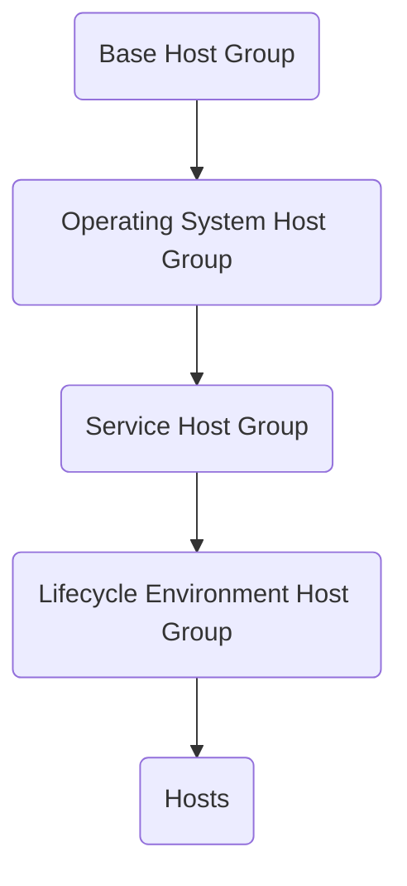
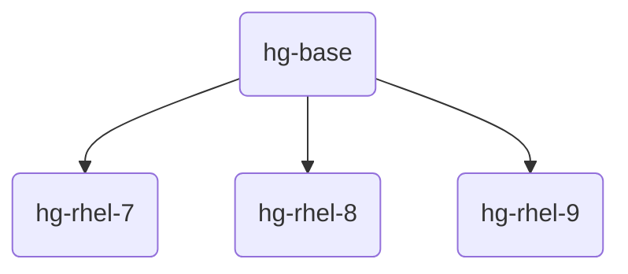
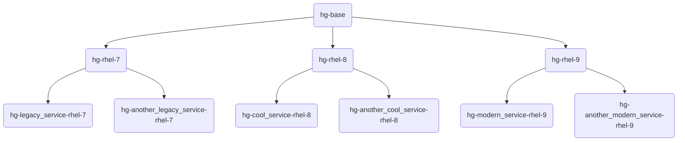

# Preface
Let me start by saying what this blog post is not.

It is not:
* An introduction into Red Hat Satellite 6
* A definitive guide to Red Hat Satellite 6
* The one and only way to work with Red Hat Satellite 6
* A "best practice" guide, there is no such thing as *best* practice
* About Red Hat Satellite **5**

It, however, is:
* A good starting point to build upon your *own* Red Hat Satellite 6 concept

# Introduction
Red Hat Satellite 6 (I'll use Satellite from now on) is a systems management product, which allows administrators to build, deploy and configure Linux systems and manage the deployed systems lifecycle.
Satellite is mainly build around Red Hat Enterprise Linux (RHEL) based distributions, but the included upstream products support many more distributions, such as Debian- or Suse Enterprise Linux (SLES) based distributions.
Satellite contains - as most Red Hat products - many upstream products such as:
- [The Foreman](https://theforeman.org/)
- [Katello](https://github.com/Katello/katello)
- [Pulp](https://pulpproject.org/)
- [Candlepin](https://www.candlepinproject.org/)

In this blog post I'll solely focus on RHEL systems, although the concepts can easily be applied to other operating systems (e.g. RHEL clones). Or, if you decide to use the upstream variant of Red Hat Satellite a Katello/Foreman installation.

Satellite is a complex product and can support many, many different use cases. Do not aim to utilize every single function Satellite provides. Tailor it to your own needs and evaluate *before* utilizing a certain function whether it makes sense in *your environment* and whether you can *maintain* it in the long run. Satellite solves many problems, but when you start without a concept, it will quickly develop into an unmaintainable and frustrating product.
Take your time to come up with a reasonable concept. Of course, concepts change over time, so build the concept as dynamic as possible.
With this, I'll give you an example concept, that you can customize to your needs.

# Satellite: objects, objects, objects
As I said in the introduction, Satellite is highly customizable and can support many, many use case. To be able to do that, basically everything in Satellite is a logical object, that depends or includes one or more other objects to serve a specific need.

Let's start with an easy example:

We all know RPM repositories; These are what allows us to install software on RPM based distributions. We take it as granted that we can install anything from a Red Hat repository once we installed a RHEL system. While we install any software from a Red Hat repository it is verified whether the package we are about to install is exactly, what Red Hat provided in its repository and has not been altered on the way to our systems.

This is done with GPG verification. Every package in a Red Hat repository is signed with a GPG key that ensures the integrity of the package. To be able to verify the integrity of the package, we need to have access to the GPG public key, to verify that a package was signed with the matching GPG private key. Red Hat installs these keys by default into our systems.

But what if you want to provide a non-Red Hat repository, such as for instance [Zabbix](https://www.zabbix.com)? You could either go with not providing any GPG key (**don't do that!**) or provide the GPG key along side the repository.

Sometimes, GPG keys are reused by software vendors to sign not only one specific repository, but multiple repositories. For instance a different software version might be distributed in a different repository, but would still be signed with the same GPG key.

To solve the above example, Satellite provides us with three objects:
* Product
* Repository
* Content Credential

A Product contains one or more Repositories. Content Credentials can be assigned either to a Product (so all Repositories in that Product will utilize that Content Credential) or to a specific Repository. A Content Credential itself can be a GPG key (which this example is about) or a SSL certificate. Products can be assigned to a Sync Plan. Repositories are used in Activation Keys and can be configured using Content Overrides.

I hope you see where I am going here: It quickly became **complex** with this simple example. The important lesson to learn is: **Satellite objects contain other objects, depend on other objects or make use of other objects.**

# Starting with a goal
In the previous chapter we learned that Satellite can quickly get complex, even for simple use cases. My advice would be to start with a definition of a goal before jumping into Satellite. Satellite makes only sense if you have a goal in mind. Otherwise it's just a product that introduces complexity and maintenance work.

**So, what are you trying to achieve?**
* Do you want to provide Satellite as a service to other internal customers so each of the customers can implement their unique use case? In other words, you provide the platform (Satellite) and don't care much about what everybody does in its Organization (again a Satellite object)?
* Or are you part of a Linux team that is responsible to provide a Standard Operating Environment (SOE) for all Linux servers?
* Is it both to some degree?
* Something else?

Define your goal and take it from there. Again, it makes no sense to start with Satellite without having a clear goal in mind. Everything else can be worked out later, but your goal defines the way you will define your concept.

I'll focus on defining a SOE, so my concept focuses on a **single organization**, as I don't want **anybody else** besides the Linux team to have access to the Satellite itself.

The goal is to have a stable, secure, controlled and maintainable Standard Operating Environment, which provide possiblities to customize the SOE to every unique use case, but still remain in a stable, secure, controlled and maintainable environment.

# Building a Standard Operating Environment
What actually are the building blocks of the SOE? This again highly depends on your unique requirements.

To give you a rough idea which questions need to be asked, consider the following:
* Which operating systems do we want to provide?
* Are application owners (these are your internal customers, that actually have the demand for the servers) comfortable upgrading every 6 months (default RHEL life cycle for a minor release)? Can the applications keep up with that pace?
* If you need longer support phases of minor versions, consider Extended Update Support (EUS) versions. EUS provides additional 18 months support on top of the default 6 months
* Do you have any SAP HANA deployments? SAP certifies their software on specific minor releases of RHEL and thus depend on specific EUS versions and additionally can utilize Update Services for SAP Solutions (E4S), which will provide 48 months of support
* Do you want to offer Extended Life Cycle Support (ELS) to your customers should they be in need of extended maintenance phases of an operating system (beyond the ten years offered by Red Hat)?
* Do you utilize Standard and Premium subscriptions for different Red Hat products to benefit from enhanced reaction times? Which systems should use Premium subscriptions, which should use Standard subscriptions?
* Do you want to impose any limitations on how many systems an internal customer can deploy? How are subscriptions payed for (does the Linux team buy all subscriptions and distribute all costs to the internal customer or has the internal customer to buy the subscriptions themselves)?
* What is the preferred deployment type? Bare metal, virtual machine?
* Do we need to support bare metal deployments? If so, is the hardware standarized? Bonding? VLANs?
* Any special hardware that needs special drivers (bare metal), such as Infiniband or even more specialized hardware?
* What about DNS: Has every system to be registered to an existing LDAP server (such as Microsoft Active Directory) or can a cross-forest-trust with an existing LDAP deployment using for instance Red Hat Identity Management be considered?
* Are there separate subnets for Linux systems? (important for reverse DNS when creating a cross-forest-trust with IdMs)
* Do we need to be compliant to regulations? Which ones?
* Which hardening is applicable? DISA STIG? CIS? NIST? Something different?
* How many lifecycle environments/stages should we offer? (such as dev, qa, prod)
* How do we install servers? PXE, Discovery, Gold Image, etc.?
* Should cloud instances be registed to the Satellite? (Such as instances on AWS, Azure, GCP, etc.)
* Do we want to install highly customized systems or deploy a default and configure it after the installation?
* What tool do we use to configure the systems? Satellite? Ansible Automation Platform? Puppet? Salt? Chef?
* Do we need to enforce configuration every X minutes/hours/days/weeks?
* What is our patch cycle? Every 2/4/6/* weeks?
* Do we need to do emergency patching? (**quick** patching in case a new critical CVE gets discovered)
* ...

This list can go on and on and on. It is a **very complex discussion** that will take many, many hours and is ***very important*** to get the basics right when starting of with an SOE. It will greatly help with defining the concepts. Don't make it overly complex and too detailed, you cannot iron out every detail in the beginning, but the general path forward should be well defined.

I have the following requirements for my SOE:
* No bare metal, only VMs
* My hypervisor will be [Proxmox](https://www.proxmox.com)
* Provide the current supported operating systems by Red Hat. At the time of writing these are (without ELS): RHEL 7, RHEL 8 and RHEL 9
* Have the possibility to selectively provide EUS or ELS versions
* Install systems using PXE and kickstart (no golden image)
* Configure the systems after the initial installation
* Utilize an external DHCP server
* Utilize an external DNS server
* Provide two stages: dev and prod
* Automate the system configuration after the initial deployment using Ansible Automation Platform
* Patch every 4 weeks and have the possibility to roll back two patch cycles
* Be able to do emergency patching
* Be able to deploy [FIPS](https://en.wikipedia.org/wiki/Federal_Information_Processing_Standards) compliant systems
* Ensure compliance with OpenSCAP with the benchmarks of [DISA STIG](https://public.cyber.mil/stigs) and [CIS](https://www.cisecurity.org/cis-benchmarks)
* Be able to selectively update repositories, but keep others untouched while publishing new content to Linux clients

Long term goals will be:
* Leverage Red Hat Identity Management (IDM) to allow LDAP users to connect. That is in addition to local users
* Provide the ability to selectively encrypt file systems with [LUKS](https://en.wikipedia.org/wiki/Linux_Unified_Key_Setup) utilizing [Network Bound Disk Encryption (NBDE)](https://access.redhat.com/articles/6987053) based on a [Tang](https://github.com/latchset/tang) server with [LUKS Clevis Bind](https://www.mankier.com/1/clevis-luks-bind)

# Defining a flexible SOE in Satellite
Once we defined our SOE we can start implementing it in Satellite. Satellite can cover almost every use case, but that comes with the downside of complexity, which needs to be maintained in the long run. Maintainability is the utmost important part. It doesn't help if you come up with a great SOE in Satellite which is not maintainable in the long run.

Let's start off with a naming concept.

### Naming concept
Having a concept how objects in Satellite are named not only helps to quickly identify the objects, but also keeps everything maintainable in the long run. Imagine a repository called `my_content_v23`. While this repository makes sense to you in that very moment you define it, nobody else will be able to tell what exactly the repository contains, for which operating system it is suitable and whether it contains custom built RPMs or RPMs from a software vendor; Or if it is a repository in the first place.

A good repository name might look something like this: `repo-zabbix-zabbix-rhel-8`

Without any additional information of the naming concept, we can already tell that it is a repository, which contains Zabbix and is suitable for RHEL 8 systems. You might wonder why we see two times `zabbix` - the reason is simple. The naming concept of this object looks like this: `repo-<vendor_name>-<product_name>-<operating_system_name>-<operating_system_version>`.

Including the software vendor helps to identify software of the vendor, as a vendor often has various products which are not necessarily named the same as the vendor. Take Oracle as an example, Oracle has a vast amount of different products they maintain; Such as their database(ses), Java or VirtualBox. But you can get Java not only by Oracle, but also by Red Hat. So having a repository named `repo-java-rhel-8` does not help to identify *which* Java we are talking about.

Please also keep in mind that having a naming concept is not a one-off task. It has to be maintained, extended and refined throughout the lifetime of Satellite (or really any other product), as there might be new requirements the SOE has to fullfil or the product (in this case Satellite) provides new functionality that you'd like to use. That's obviously additional operational overhead, but in my opinion far outweights the downside of maintaining it.

In the following table I'd like to share my very own naming concept. It is not perfect, it does surely not cover every possible scenario, but I believe it is a very good starting point. As I said earlier, I have implemented this very same naming concept at numerous customers who are still using it (to my knowledge) to this date. Your naming concept might vary compared to mine, which is perfectly fine. Just remember to keep it as flexible as possible and be consistent throughout.

I like to prefix my objects always with a unique prefix that helps to quickly identify the object in question. Further, I don't have a prefix or a naming concept for objects I don't use or I don't plan to use in the long run. With that in mind, let's take a look at the table:

One last note: You'll see me use the term *service* throughout the table. I'll explain in depth what I define as a *service* in Satellite in a later chapter.

| Object                              | Concept                                                                                                                                    |
| :---------------------------------- | :----------------------------------------------------------------------------------------------------------------------------------------- |
| Activation Key                      | `ak-<service_name>-<operating_system_name>-<operating_system_version>-<lifecycle_environment_abbreviation>-<subscription_type>`            |
| Bookmark                            | `bm-<descriptive_name>`                                                                                                                    |
| Content Credential (GPG)            | `cc-gpg-<vendor>-<product_or_repository_name>-<operating_system_name>-<operating_system_version>`                                          |
| Content Credential (SSL Certificate)| `cc-ssl-<vendor>-<product_or_repository_name>`                                                                                             |
| Content View                        | `cv-<vendor_or_source>-<operating_system_name>-<operating_system_version>`                                                                 |
| Composite Content View              | `ccv-<service_name>-<operating_system_name>-<operating_system_version>`                                                                    |
| Domain                              | `<domain.name>`                                                                                                                            |
| Host Group (top level)              | `hg-base`                                                                                                                                  |
| Host Group (operating system level) | `hg-<operating_system_name>-<operating_system_version>`                                                                                    |
| Host Group (service level)          | `hg-<service_name>-<operating_system_name>-<operating_system_version>`                                                                     |
| Host Group (stage level)            | `hg-<service_name>-<operating_system_name>-<operating_system_version>-<lifecycle_environment_abbreviation>`                                |
| Job Template                        | `jt-<descriptive_name>`                                                                                                                    |
| Lifecycle Environment               | `lce-<descriptive_name>-<lifecycle_abbriviation>`                                                                                          |
| Location                            | `loc-<stage>[-zone]`                                                                                                                       |
| OpenSCAP content                    | `osc-<benchmark_name>-<benchmark_version>-<operating_system_name>-<operating_system_version>`                                              |
| OpenSCAP policy                     | `op-<**TODO**>`                                                                                                                            |
| OpenSCAP tailoring file             | `otf-<descriptive_name>`                                                                                                                   |
| Organization                        | `org-<name>`                                                                                                                               |
| Parameter (Global, Host, etc.)      | `p-<descriptive_name>`                                                                                                                     |
| Partition Table                     | `pt-<bios_and_or_uefi>-<descriptive_name>`                                                                                                 |
| Product                             | `prd-<vendor>-<product>[-<operating_system_name>-<operating_system_version]`                                                               |
| Provisioning Template               | `pvt-<provisioning_template_type>[-descriptive_name]`                                                                                      |
| Realm                               | `<ZONE_NAME>.<STAGE>`                                                                                                                      |
| Repository (RPM)                    | `repo-<vendor_or_source>-<package_versions_or_latest>-<operating_system_name>-<operating_system_version>-<architecture>`                   |
| Snippet                             | `snt-<descriptive_name>`                                                                                                                   |
| Subnet                              | `sn-<stage>-<zone>-<network_address>[-<network_usage_type>]`                                                                               |
| Sync Plan                           | `sync-<internal_name>[-<descriptive_name]`                                                                                                 |

If you paid attention to the above table, and are familar with Satellite already, you probably noticed that `Operating Systems` and `Hardware Models` are missing in that list. Of course, they are getting used, but they are not customized.
For the `Hardware Models` the reason is simple: It's not possible. While you can definitively rename them in Satellite (as an object), the `Hardware Model` on the system itself stays the same. It is detected by `dmidecode` (if I recall correctly) and reported back to Satellite. Satellite will then override the assigned `Hardware Model` to the detected one, which, of course, does not match the name we have chosen (e.g. `hm-hpe-proliant-dl380-gen_10` vs `HPE ProLiant DL380 Gen10`). :frowning_face:

I have chosen to not rename operating systems, as they speak for themselves (when utilizing only RHEL - as in my case), e.g. `RedHat 8.7`.

Anyway, No matter how hard you try to come up with a naming concept that fits *all* use cases, you'll always end up with *some* exceptions. But they should really be only that: **exceptions**.
Too many exceptions mean you need to revise your naming concept.
Yes, I know that it is work, but it'll benefit you in the long run, as a proper naming concept will prevent 'uncontrolled growth'; And additionally, if you automated it with 
Ansible (we'll come to that in my next blog post), it'll be easy to setup and change your naming concept :grin:

Examples, exceptions, and additional notes to the naming concept of the objects:



<table>
  <thead>
    <tr>
      <th>Object</th>
      <th>Example</th>
      <th>Notes and exceptions</th>
    </tr>
  </thead>
  <tbody>
    <tr>
      <td>Activation Key</td>
      <td>
        <ul>
          <li><code class="language-plaintext highlighter-rouge">ak-ansible_automation_platform-rhel-8-dev-s</code></li>
          <li><code class="language-plaintext highlighter-rouge">ak-webservers-rhel-8_eus-prod-s</code></li>
          <li><code class="language-plaintext highlighter-rouge">ak-database_servers-rhel-6_els-prod-p</code></li>
       </ul>
     </td>
     <td>
       <ul>
         <li>None</li>
       </ul>
     </td>
    </tr>
    <tr>
      <td>Bookmark</td>
      <td>
        <ul>
          <li><code class="language-plaintext highlighter-rouge">bm-capsules</code></li>
          <li><code class="language-plaintext highlighter-rouge">bm-rhel-8</code></li>
       </ul>
     </td>
     <td>
       <ul>
         <li>Bookmarks help to quickly find or target (when running a job template for instance) a specific set of servers</li>
         <li>They are definitively not required, but are quite handy at times for repetitive tasks</li>
       </ul>
     </td>
    </tr>
    <tr>
      <td>Content Credential (GPG)</td>
      <td>
        <ul>
          <li><code class="language-plaintext highlighter-rouge">gpg-fedora-epel-el-8</code></li>
          <li><code class="language-plaintext highlighter-rouge">gpg-zabbix-zabbix-rhel-8</code></li>
          <li><code class="language-plaintext highlighter-rouge">gpg-some_company-yet_another_product-rhel-7_eus</code></li>
       </ul>
     </td>
     <td>
       <ul>
         <li>None</li>
       </ul>
     </td>
    </tr>
    <tr>
      <td>Content View</td>
      <td>
        <ul>
          <li><code class="language-plaintext highlighter-rouge">cv-zabbix-zabbix-rhel-8</code></li>
          <li><code class="language-plaintext highlighter-rouge">cv-rhcdn-base-rhel-8</code></li>
          <li><code class="language-plaintext highlighter-rouge">cv-rhcdn-base-rhel-8_6</code></li>
       </ul>
     </td>
     <td>
        <ul>
          <li>RHCDN stands for Red Hat Content Delivery Network. All repositories by Red Hat have <b>rhcdn</b> as vendor.</li>
          <li>All base operating content views are named <b>base</b></li>
          <li>Denoting a special version of RHEL with <b>&lt;major_version&gt;&lt;minor_version&gt;</b></li>
       </ul>
     </td>
    </tr>
    <tr>
      <td>Composite Content View</td>
      <td>
        <ul>
          <li><code class="language-plaintext highlighter-rouge">ccv-ansible_automation_platform-rhel-8</code></li>
          <li><code class="language-plaintext highlighter-rouge">ccv-default-rhel-8_eus</code></li>
          <li><code class="language-plaintext highlighter-rouge">ccv-database-rhel-6_els</code></li>
       </ul>
     </td>
     <td>
        <ul>
          <li>Composite Content Views contain a specific set of content views that the service needs. Again, I'll explain the context of a service later on</li>
       </ul>
     </td>
    </tr>
    <tr>
      <td>Domain</td>
      <td>
        <ul>
          <li><code class="language-plaintext highlighter-rouge">company.example.com</code></li>
          <li><code class="language-plaintext highlighter-rouge">de.company.example.com</code></li>
       </ul>
     </td>
     <td>
        <ul>
          <li>Domains speak for themselves and thus there is no naming concept around them (which would be useless anyway)</li>
       </ul>
     </td>
    </tr>
    <tr>
      <td>Host Group (top level)</td>
      <td>
        <ul>
          <li><code class="language-plaintext highlighter-rouge">hg-base</code></li>
       </ul>
     </td>
     <td>
        <ul>
          <li><code class="language-plaintext highlighter-rouge">hg-base</code> in this instance is not an example but really the name of the topmost hostgroup. Of course you can chose a different name, but *base* made sense to me</li>
       </ul>
     </td>
    </tr>
    <tr>
      <td>Host Group (operating system level)</td>
      <td>
        <ul>
          <li><code class="language-plaintext highlighter-rouge">hg-rhel-7</code></li>
          <li><code class="language-plaintext highlighter-rouge">hg-rhel-8</code></li>
          <li><code class="language-plaintext highlighter-rouge">hg-rhel-9</code></li>
       </ul>
     </td>
     <td>
       <ul>
         <li>On this this hostgroup level we define the base operating system parameters. Such as the version, the image used, etc.</li>
         <li>All systems that utilize e.g. RHEL 8 are nested in hostgroups below <code class="language-plaintext highlighter-rouge">hg-rhel-8</code></li>
       </ul>
     </td>
    </tr>
    <tr>
      <td>Host Group (service level)</td>
      <td>
        <ul>
          <li><code class="language-plaintext highlighter-rouge">hg-ansible_automation_platform-rhel-8</code></li>
          <li><code class="language-plaintext highlighter-rouge">hg-webservers-rhel-7_eus</code></li>
          <li><code class="language-plaintext highlighter-rouge">hg-database-rhel-6_els</code></li>
       </ul>
     </td>
     <td>
       <ul>
         <li>This hostgroup level is merely used to group all hostgroups of a service together. I use it additionally to define the root password for all servers of that specific service</li>
       </ul>
     </td>
    </tr>
    <tr>
      <td>Host Group (lifecycle level)</td>
      <td>
        <ul>
          <li><code class="language-plaintext highlighter-rouge">hg-ansible_automation_platform-rhel-8-dev</code></li>
          <li><code class="language-plaintext highlighter-rouge">hg-webservers-rhel-7_eus-test</code></li>
          <li><code class="language-plaintext highlighter-rouge">hg-database-rhel-6_els-prod</code></li>
       </ul>
     </td>
     <td>
       <ul>
         <li>Below these hostgroups the servers are finally nested. They define the lifecycle environment as well as some other important information (more to that later)</li>
       </ul>
     </td>
    </tr>
    <tr>
      <td>Job template</td>
      <td>
        <ul>
          <li><code class="language-plaintext highlighter-rouge">jt-update_all_packages</code></li>
          <li><code class="language-plaintext highlighter-rouge">jt-apply_security_errata</code></li>
       </ul>
     </td>
     <td>
       <ul>
         <li>None</li>
       </ul>
     </td>
    </tr>
    <tr>
      <td>Lifecycle environment</td>
      <td>
        <ul>
          <li><code class="language-plaintext highlighter-rouge">lce-default-dev</code></li>
          <li><code class="language-plaintext highlighter-rouge">lce-default-test</code></li>
          <li><code class="language-plaintext highlighter-rouge">lce-default-prod</code></li>
       </ul>
     </td>
     <td>
       <ul>
         <li>None</li>
       </ul>
     </td>
    </tr>
    <tr>
      <td>Location</td>
      <td>
        <ul>
          <li><code class="language-plaintext highlighter-rouge">loc-core</code></li>
          <li><code class="language-plaintext highlighter-rouge">loc-core/loc-core-dev</code></li>
          <li><code class="language-plaintext highlighter-rouge">loc-core/loc-core-prod</code></li>
       </ul>
     </td>
     <td>
       <ul>
         <li>None</li>
       </ul>
     </td>
    </tr>
    <tr>
      <td>OpenSCAP content</td>
      <td>
        <ul>
          <li><code class="language-plaintext highlighter-rouge">osc-disa_stig-1_11-rhel-7</code></li>
          <li><code class="language-plaintext highlighter-rouge">osc-disa_stig-1_9-rhel-8</code></li>
       </ul>
     </td>
     <td>
       <ul>
         <li>None</li>
       </ul>
     </td>
    </tr>
    <tr>
      <td>OpenSCAP Policy</td>
      <td>
        <ul>
          <li><code class="language-plaintext highlighter-rouge">TODO</code></li>
       </ul>
     </td>
     <td>
       <ul>
         <li>None</li>
       </ul>
     </td>
    </tr>
    <tr>
      <td>OpenSCAP Tailoring File</td>
      <td>
        <ul>
          <li><code class="language-plaintext highlighter-rouge">otf-security_exceptions</code></li>
       </ul>
     </td>
     <td>
       <ul>
         <li>None</li>
       </ul>
     </td>
    </tr>
    <tr>
      <td>Organization</td>
      <td>
        <ul>
          <li><code class="language-plaintext highlighter-rouge">org-core</code></li>
       </ul>
     </td>
     <td>
       <ul>
         <li>None</li>
       </ul>
     </td>
    </tr>
    <tr>
      <td>Parameter</td>
      <td>
        <ul>
          <li><code class="language-plaintext highlighter-rouge">p-ansible_inventory_id</code></li>
          <li><code class="language-plaintext highlighter-rouge">p-ansible_controller_host</code></li>
          <li><code class="language-plaintext highlighter-rouge">p-enable_fips_deployment</code></li>
       </ul>
     </td>
     <td>
       <ul>
         <li>Parameters can be virtually anywhere. They could be global parameters, hostgroup parameters, operating system parameters, host parameters, etc.</li>
         <li>The prefix <code class="language-plaintext highlighter-rouge">p-</code> was chose to not overly complicate it, but still make a destinction of Red Hat default parameters (no prefix)</li>
         <li>Global Parameters could be overriden on a host or hostgroup level and then become a host or hostgroup parameter, thus introducing several prefixes made no sense to me</li>
       </ul>
     </td>
    </tr>
    <tr>
      <td>Partition Table</td>
      <td>
        <ul>
          <li><code class="language-plaintext highlighter-rouge">pt-bios-default</code></li>
          <li><code class="language-plaintext highlighter-rouge">pt-uefi-default</code></li>
          <li><code class="language-plaintext highlighter-rouge">pt-bios_uefi-custom_name</code></li>
       </ul>
     </td>
     <td>
       <ul>
         <li>None</li>
       </ul>
     </td>
    </tr>
    <tr>
      <td>Product</td>
      <td>
        <ul>
          <li><code class="language-plaintext highlighter-rouge">prd-zabbix-zabbix</code></li>
          <li><code class="language-plaintext highlighter-rouge">prd-fedora-epel</code></li>
          <li><code class="language-plaintext highlighter-rouge">prd-elastic-elastic</code></li>
       </ul>
     </td>
     <td>
       <ul>
         <li>None</li>
       </ul>
     </td>
    </tr>
    <tr>
      <td>Provisioning Template</td>
      <td>
        <ul>
          <li><code class="language-plaintext highlighter-rouge">pvt-provision</code></li>
          <li><code class="language-plaintext highlighter-rouge">pvt-ipxe</code></li>
          <li><code class="language-plaintext highlighter-rouge">pxt-pxelinux-custom_name</code></li>
       </ul>
     </td>
     <td>
       <ul>
         <li>Having more than one template of a certain type (e.g. <code class="language-plaintext highlighter-route">Provision</code>) introduces the necessity to make use of the custom descriptive name at the end to keep everything tidy</li>
       </ul>
     </td>
    </tr>
    <tr>
      <td>Realm</td>
      <td>
        <ul>
          <li><code class="language-plaintext highlighter-rouge">CORE.DEV</code></li>
          <li><code class="language-plaintext highlighter-rouge">CUSTOM_REALM.PROD</code></li>
          <li><code class="language-plaintext highlighter-rouge">ANOTHER_REALM.TEST</code></li>
       </ul>
     </td>
     <td>
       <ul>
         <li>There might be usecases where this name concept does not fit well (e.g. the same realm used throughout all stages and zones, or when the realms are not tied to a stage)</li>
       </ul>
     </td>
    </tr>
    <tr>
      <td>Repository</td>
      <td>
        <ul>
          <li><code class="language-plaintext highlighter-rouge">repo-zabbix-zabbix-6_0-rhel-8</code></li>
          <li><code class="language-plaintext highlighter-rouge">repo-elastic-elastic-8-el-8</code></li>
          <li><code class="language-plaintext highlighter-rouge">repo-fedora-epel-8-el-8</code></li>
       </ul>
     </td>
     <td>
       <ul>
         <li>None</li>
       </ul>
     </td>
    </tr>
    <tr>
      <td>Snippet</td>
      <td>
        <ul>
          <li><code class="language-plaintext highlighter-rouge">snt-idm_registration</code></li>
          <li><code class="language-plaintext highlighter-rouge">snt-luks_encryption</code></li>
          <li><code class="language-plaintext highlighter-rouge">snt-configure_time_synchronization</code></li>
       </ul>
     </td>
     <td>
       <ul>
         <li>None</li>
       </ul>
     </td>
    </tr>
    <tr>
      <td>Subnet</td>
      <td>
        <ul>
          <li><code class="language-plaintext highlighter-rouge">sn-dev-default-172_31_12_0</code></li>
          <li><code class="language-plaintext highlighter-rouge">sn-dev-default-172_31_12_0-satellite</code></li>
          <li><code class="language-plaintext highlighter-rouge">sn-dev-secure-172_31_100_0-frontend</code></li>
          <li><code class="language-plaintext highlighter-rouge">sn-prod-secure-172_31_200_0-custom_name</code></li>
       </ul>
     </td>
     <td>
       <ul>
         <li>In my usecase there are only <code class="language-plaintext highlighter-rouge">/24</code> (<code class="language-plaintext highlighter-rouge">255.255.255.0</code>) subnets. 
             For usecases where different subnet sizes are used, it makes sense to add the netmask (e.g. <code class="language-plaintext highlighter-rouge">255.255.255.0</code>) or the network suffix 
             (e.g. <code class="language-plaintext highlighter-rouge">24</code>) into the name</li>
         <li>The optional <code class="language-plaintext highlighter-rouge">network_usage_type</code> at the end (e.g. <code class="language-plaintext highlighter-rouge">satellite</code> or <code class="language-plaintext highlighter-rouge">frontend</code>, etc.) is useful 
             in certain circumstances.</li>
         <li>If you have a capsule that speaks directly to the Satellite, it will be located in a usual subnet (network-wise), but will surely not have the same subnet definition inside of Satellite. That's because you assign certain
             Capsules (e.g. <code class="language-plaintext highlighter-rouge">Remote Execution Capsule</code>) to a subnet, which is different for an "ordinary" host (which will use a Capsule) and for a Capsule (which will use the Satellite)</li>
         <li>In practice you then have for each Capsule a separate subnet definition, unless you have multiple Capsules within the same subnet</li>
       </ul>
     </td>
    </tr>
    <tr>
      <td>Sync Plan</td>
      <td>
        <ul>
          <li><code class="language-plaintext highlighter-rouge">sync-daily-default</code></li>
          <li><code class="language-plaintext highlighter-rouge">sync-weekly-3rd_party</code></li>
       </ul>
     </td>
     <td>
       <ul>
         <li>None</li>
       </ul>
     </td>
    </tr>
  </tbody>
</table>



That covers the naming concept I use.

### Essential Satellite Objects
Before we start talking about services, we first need to implement some essentials within the Satellite. This chapter and its sub-chapters cover the essential objects and thoughts behind the decisions that went into when designing the general architecture.

#### Domains, Locations, Realms and Subnets
These four objects highly depend on your very specific needs, that's why I just describe a *possible* use case.

For the sake of this example we are going to assume that our company's domain is `example.com`. Let's further assume, it is a company-wide policy that there are three stages and each of those stages have their very own subdomain.
The company has implemented a Microsoft Active Directory (AD). AD is used both as authentication source for users and to manage the existing domains. Lastly, to make it easy, the company only makes use of `/24` networks throughout.

As we set our fictional example, let's talk this through. Typically, a company has different subdomains for their different stages. This could for instance look something like this:

| Stage  | Domain               |
| :----- | :------------------- |
| `dev`  | `dev.example.com`    |
| `test` | `qa.example.com`     |
| `prod` | `prod.example.com`   |

*Usually*, these three stages would have *different* ADs - one for each stage.

Okay, so what about domains of our Linux servers? Well, there are three (actually two) options:
1. Keep using Microsoft AD and join the hosts to the AD using `adcli`
2. Introduce a new component to your infrastructure: [Red Hat Identity Management (IdM)](https://access.redhat.com/products/identity-management/) and implement a [cross-forest trust](https://access.redhat.com/documentation/de-de/red_hat_enterprise_linux/8/html/planning_identity_management/planning-a-cross-forest-trust-between-idm-and-ad_planning-identity-management) between AD and IdM
3. This is not really an option in my opinion, but, of course, you could make use of local users. In a very small environment this might be feasible, but for every environment that has a few more than 10 or so users, it just gets unmanageable

There is no right or wrong in chosing either or the other (other than as already mentioned possibly option 3). For the sake of this example, I'd like to use IdM because it integrates nicely with Satellite. I know, that this is not possible everywhere, but since this is an imaginary scenario, let's assume it would be possible to introduce IdM.

Just a quick note on integrating Linux hosts directly into AD: Integrating the hosts into AD would in almost all cases make most sense to do during Kickstart provisioning using `adcli`.

Back to IdM; With a cross-forest trust we should think about creating additional subnets and subdomains specifically for Linux host. At first glance, this might sound like an overkill, but if you think about it: If we have two different DNS servers (AD + IdM), who is responsible for which domains and subnets? Right, you really *don't* want to split subnets in a way that half of a subnet is managed by AD and the other one by IdM. If we think further, reverse DNS entries will be a real challenge if we don't have dedicated subnets and domains for Linux.

Say, we would create additional domains, that would be managed by IdM. That could look for instance like this:

| Stage  | Domain                   |
| :----- | :----------------------- |
| `dev`  | `lnx.dev.example.com`    |
| `test` | `lnx.qa.example.com`     |
| `prod` | `lnx.prod.example.com`   |

An IdM can only - to my knowledge - provide *one* realm. Exactly one, not more. This would mean that we would need three IdMs for the three domains we have:

| Domain                   | Realm                    |
| :----------------------- | :----------------------- |
| `lnx.dev.example.com`    | `LNX.DEV.EXAMPLE.COM`    |
| `lnx.qa.example.com`     | `LNX.QA.EXAMPLE.COM`     |
| `lnx.prod.example.com`   | `LNX.PROD.EXAMPLE.COM`   |

Each of these IdMs would form a cross-forest trust with its counterpart AD.

:warning: There is a drawback to using IdMs and integrating them with Satellite.

Satellite Capsules and IdMs have a 1 to 1 relationship. You can only integrate a single Capsule with a single IdM (or really the realm). Since an IdM can only provide *one* realm, and a Capsule can only be configured to use *one* realm, the relationship is 1 IdM to 1 Capsule.

The Satellite internal Capsule could for instance be integrated with one realm; That is useful for a setup where you really only have one IdM. In this example, our best bet would be to make use of Capsules. Each per stage and zone. Yes, that sounds like much, but it will, again, provide a high degree of flexibility.

Next, we need to talk about locations. In this example, we can create at least three locations:

| Domain                   | Location                 |
| :----------------------- | :----------------------- |
| `lnx.dev.example.com`    | `loc-dev`                |
| `lnx.qa.example.com`     | `loc-qa`                 |
| `lnx.prod.example.com`   | `loc-prod`               |

So, I wrote *at least* above. Well, we can nest locations below those 'stage-locations'. That could be the case if, for instance, each stage is logically segregated into multiple zones. These could be represented for instance like so:

| Stage                    | Zone                     | Location                     |
| :----------------------- | :----------------------- | :--------------------------- |
| `dev`                    | `trusted`                | `loc-dev\loc-dev-trusted`    |
| `dev`                    | `dmz`                    | `loc-dev\loc-dev-dmz`        |
| `test`                   | `trusted`                | `loc-qa\loc-qa-trusted`      |
| `test`                   | `dmz`                    | `loc-qa\loc-qa-dmz`          |
| `prod`                   | `trusted`                | `loc-prod\loc-prod-trusted`  |
| `prod`                   | `dmz`                    | `loc-prod\loc-prod-dmz`      |

Of course, you can nest or rather separate similarly for subnets, domains and as well the IdMs. This, of course, depends very much on your specific needs.

Lastly, we need to talk about Subnets. These, again, highly depend on your very specific use case. In my environment, this is obviously pretty easy. I don't have any zones inside a stage, they are all the same. Let's continue using the example. We see in the above table that we have a `trusted` and an untrusted zone per stage. These zones can obviously contain multiple Subnets per zone. If you recall, I wrote above that in this fictional scenario all networks would be `/24` networks. This makes the naming of the Subnets pretty easy and could look for instance something like this:

| Stage                    | Zone                     | Subnet  Address              |  Subnet Name                     |
| :----------------------- | :----------------------- | :--------------------------- | :---------------------------     |
| `dev`                    | `trusted`                | `172.31.1.0/24`              | `sn-dev-trusted-172_31_1_0`      |
| `dev`                    | `dmz`                    | `172.31.2.0/24`              | `sn-dev-dmz-172_31_2_0`          |
| `test`                   | `trusted`                | `172.31.10.0/24`             | `sn-test-trusted-172_31_10_0`    |
| `test`                   | `dmz`                    | `172.31.20.0/24`             | `sn-test-dmz-172_31_20_0`        |
| `prod`                   | `trusted`                | `172.31.100.0/24`            | `sn-test-dmz-172_31_100_0`       |
| `prod`                   | `dmz`                    | `172.31.200.0/24`            | `sn-test-dmz-172_31_200_0`       |

Do you recall the naming concept of the Subnets? It is `sn-<stage>-<zone>-<network_address>[-<network_usage_type>]`. So what's actually up with the `[-network_usage_type]` at the end? Well, sometimes, there are networks that fulfill a special function. Such as admin networks, frontend networks and backend networks. To denote these Subnets as well, you could define and add abbreviations of those functions to the Subnet. For instance `sn-dev-dmz-172_31_2_0` might be a **f**ront**e**nd network, so it would become `sn-dev-dmz-172_31_2_0-fe`.

There is also a special 'type' of Subnets (in terms of configuration), which I call *Satellite Subnets*. These *Satellite Subnets* denote Subnets especially for Capsules, and Capsules only. The reason behind this is, that Subnets have certain attributes you can set, such as:
* `TFTP Capsule`
* `Template Capsule`
* `Remote Execution Capsules`

Obviously, all clients will (in most scenarios) connect to a Capsule and therefore use the Capsule as e.g. *Remote Execution Capsule*. The Capsule itself on the other hand, will use the Satellite as its *Remote Execution Capsule*, which makes it necessary to define a seperate Subnet only for a Capsule. Does this mean you need to define each Subnet twice (one for a Capsule and one for all other hosts)? Certainly no, I'd create those Subnets on demand, so whenever you add a new Capsule, you'd create a Subnet for it (unless it exists already of course).

### Lifecycle Environments (LCE)
Again, like basically everything in a SOE, the definition of the Lifecycle Environments and the Lifecycle Environment Paths are highly dependent on your needs.
When we look at the different stages, one would think it's obvious to simply create three Lifecycle Environments:

| Stage                    | Lifecycle Environment    |
| :----------------------- | :----------------------- |
| `dev`                    | `lce-default-dev`        |
| `test`                   | `lce-default-qa`         |
| `prod`                   | `lce-default-prod`       |

The Lifecycle Environment Path would then look something like this: 

`Library` -> `lce-default-dev` -> `lce-default-qa` -> `lce-default-prod`

:information_source: `Library` is Satellite's internal Lifecycle Environment

Easy, right? :blush:

Well, if we think about it, couldn't it be that there are in fact services in `dev` and `qa` which are actually `prod`? :thinking: 

What about, for instance, the IdM servers? If you think about it, they *are* actually productive systems; If the `dev` and `qa` IdMs go down, nobody can log into a server in neither `dev` nor `qa`.
There are certain ways how this could be tackled.

You can create a different Lifecycle Environment Path for only those IdMs (and other production services that are not actually in `prod`) and treat all of the Lifecycle Environments in that path as **production**.

So, it might look something like this: `lce-essential_services-dev` -> `lce-essential_services-qa` -> `lce-essential_services-prod`

Another way would be to carefully document such exceptions in a place where each team member that operates the Satellite can look it up easily. This, however, introduces the 'human factor' into the mix. Often times, at least from my experience, such 'organisational measures' tend to start good. But the team grows and new essential services come and go and suddenly the list or documentation that was made with good intention, is not useful anymore.

The third way I can think of, would be to place those systems actually in `prod` - where they should belong. That's certainly the easiest way of doing things, but there is a catch. If you have physically separated your stages, this certainly won't be taken well by your security department, as you would punch a lot of holes into the firewalls to ensure all servers can reach the IdM that is responsible for `dev` that is actually located in `prod`.

My personal opinion is, that creating a separate Lifecycle Environment Path with separate Lifecycle Environments for such essential services is the way to go. Sure, you still need to remember that this particular Lifecycle Environment Path is 'special', but it certainly is better than the other two options, in my opinion.

### Definition of a service
Now, that we have the essential objects defined, let's actually focus on defining services. What does *services* refer to and what are their benefits?

To put it into one sentence: A service is a logical unit to group every server that has the same function profile and owner.

That sounds great but is not very meaningful.

Let me try to brake it down into a few sentences with an example.

A typical usecase of an internal customers of yours might be:

"*Hey, we are team [insert_name] and we want to deploy and operate [insert_application]. For this task we need to have [insert_number_of_hosts] with [insert_operating_system_and_version]. Additionally, we need the RPM repositories of the software vendor to be available for installation on these servers.*"

The above example would be what I refer to as a *service*.

All of the servers this customer wants to be installed refer all to the same 'function profile'. While, technically, these servers can differ, they all belong to the same group of people and serve the same purpose: provide a specific service. You could, of course, argue that this service contains a database server and three webserver as well as a loadbalancer and thus, they don't have the same 'function profile'. Yes, that is true, but that differentiation will be done by the customer, not by the operator of the Satellite. For the operator it is the very same function profile, since all these servers serve the same shared purpose: provide a specific *service*.

 
Allow me to explain the reasoning behind this:  
While a logical grouping of all webservers and a logical grouping of all database servers seems like a good idea in theory, in practice it isn't. That is of course, unless they all belong to the same service.

Let's assume for a minute you have two customers that request the same set of servers (let's assume they would be webservers). If you group them together, they will all receive the same content (RPM-wise), right? But what if one web application is unable to run a certain version of nginx and thus need to stay a version below the current latest? Sure, you could argue that the customer should just pin the nginx version. Okay, problem solved.

But what if the other customer comes back and tells you that while he is on RHEL 8 now, he'd like to go to RHEL 9 next week, as the lifecycle of his web application requires him to do so. Now you have a conflict of interest. Your other customer has to stay on a version below latest on nginx and the other one wants to go to RHEL 9 next week.

So what's the solution? Right. Different services. This way you ensure that every customer gets **exactly** what he needs. Not more, not less. The function profile might change over time. A customer might ask you to additionally provide a special RPM repository for a special database he needs. With split services, no issue at all. With combining all webservers together: you have an issue.

The definition of - what I call - a service is designed in such a way, that it should accomodate almost all use cases.

But what components are now part of a service?
First, let me share the main objects that are part of such a service:
* Content View(s)
* Composite Content View
* Activation keys
* User
* Host groups
* Hosts

Optionally (depending on the needs of the customer), you additionally have the following:
* Custom products that contain each custom repositories
* Custom lifecycles

#### Content View (CV) and Composite Content View (CCV) structure
To be able to provide every currently supported (by Red Hat) operating system (OS), the structure needs to be flexible. That's where the *base CVs* come into play. Every currently supported OS will have one base CV (if required by the customers, of course).
At the time of this writing, Red Hat supports the following OS versions:
* Red Hat Enterprise Linux (RHEL) 9 (latest)
* Red Hat Enterprise Linux (RHEL) 9.2 (EUS)
* Red Hat Enterprise Linux (RHEL) 9.0 (EUS)
* Red Hat Enterprise Linux (RHEL) 8 (latest)
* Red Hat Enterprise Linux (RHEL) 8.8 (EUS)
* Red Hat Enterprise Linux (RHEL) 8.6 (EUS)
* Red Hat Enterprise Linux (RHEL) 7.10
* Red Hat Enterprise Linux (RHEL) 6.10 (ELS)

This would translate to the following base CVs:
* `cv-rhcdn-base-rhel-9`
* `cv-rhcdn-base-rhel-9_2`
* `cv-rhcdn-base-rhel-9_0`
* `cv-rhcdn-base-rhel-8`
* `cv-rhcdn-base-rhel-8_8`
* `cv-rhcdn-base-rhel-8_6`
* `cv-rhcdn-base-rhel-7`
* `cv-rhcdn-base-rhel-6`

Those base CVs would contain only the bare minimum that is required in terms of repositories:

**RHEL9**

* **Latest**
    * Red Hat Enterprise Linux 9 for x86_64 - BaseOS RPMs 9.x
    * Red Hat Enterprise Linux 9 for x86_64 - AppStream RPMs 9.x
    * Red Hat Enterprise Linux 9 for x86_64 - BaseOS Kickstart 9.x
    * Red Hat Enterprise Linux 9 for x86_64 - AppStream Kickstart 9.x
  
* **Extended Update Support (EUS)**

    :information_source: When deploying EUS versions, the Kickstart repositories need to match the EUS version. Using RHEL 9.2 EUS, you need to enable the RHEL 9.2 Kickstart repositories
    * Red Hat Enterprise Linux 9 for x86_64 - BaseOS - Extended Update Support (RPMs)
    * Red Hat Enterprise Linux 9 for x86_64 - AppStream - Extended Update Support (RPMs)
    * Red Hat Enterprise Linux 9 for x86_64 - BaseOS Kickstart 9.x
    * Red Hat Enterprise Linux 9 for x86_64 - AppStream Kickstart 9.x

**RHEL8**

* **Latest**
    * Red Hat Enterprise Linux 8 for x86_64 - BaseOS RPMs 8.x
    * Red Hat Enterprise Linux 8 for x86_64 - AppStream RPMs 8.x
    * Red Hat Enterprise Linux 8 for x86_64 - BaseOS Kickstart 8.x
    * Red Hat Enterprise Linux 8 for x86_64 - AppStream Kickstart 8.x
  
* **Extended Update Support (EUS)**

    :information_source: When deploying EUS versions, the Kickstart repositories need to match the EUS version. Using RHEL 8.6 EUS, you need to enable the RHEL 8.6 Kickstart repositories
    * Red Hat Enterprise Linux 8 for x86_64 - BaseOS - Extended Update Support (RPMs)
    * Red Hat Enterprise Linux 8 for x86_64 - AppStream - Extended Update Support (RPMs)
    * Red Hat Enterprise Linux 8 for x86_64 - BaseOS Kickstart 8.x
    * Red Hat Enterprise Linux 8 for x86_64 - AppStream Kickstart 8.x

**RHEL7**

:information_source: RHEL 7 *EUS* and *Latest* are, right now, effectively the same (RHEL 7.10). This *will* change, once RHEL 7 transitions to ELS, where the ELS repositories need to be enabled instead (see RHEL 6)
* Red Hat Enterprise Linux 7 Server RPMs x86_64 7Server
* Red Hat Enterprise Linux 7 Server Kickstart x86_64 7.9

**RHEL6**

:information_source: RHEL 6 is only available as ELS. In this case the ELS repository needs to be enabled, as well as the latest available Kickstart repository
* Red Hat Enterprise Linux 6 Server - Extended Life Cycle Support (RPMs)
* Red Hat Enterprise Linux 6 Server (Kickstart)

In earlier version of RHEL, there used to be separate repositories, which are not required, but which, of course, can be added to different CVs right away to have them handy and up to date when a customer asks for them.

For RHEL 7 these would be for instance the following:
* Red Hat Enterprise Linux 7 Server - Extras RPMs x86_64
* Red Hat Enterprise Linux 7 Server - Optional RPMs x86_64 7Server
* Red Hat Enterprise Linux 7 Server - Supplementary RPMs x86_64 7Server

They could be added to following additional CVs:
* `cv-rhcdn-base_extras-rhel-7` 
* `cv-rhcdn-base_optional-rhel-7` 
* `cv-rhcdn-base_supplementary-rhel-7`

The very same can be done for debug and source RPMs, if you are in need to provide these to your customers. Let's take RHEL 8 as example:
**Source RPMs**
* Red Hat Enterprise Linux 8 for x86_64 - BaseOS (Source RPMs)
* Red Hat Enterprise Linux 8 for x86_64 - AppStream (Source RPMs)

The above repositories could be turned into the following additional CV:
* `cv-rhcdn-base_source_rpms-rhel-8`

**Debug RPMs**
* Red Hat Enterprise Linux 8 for x86_64 - BaseOS (Debug RPMs)
* Red Hat Enterprise Linux 8 for x86_64 - AppStream (Debug RPMs)

The above repositories could be turned into the following additional CV:
* `cv-rhcdn-base_source_rpms-rhel-8`

:warning: Please do **not** create the debug and source CVs by default, when you don't need them. Adding too much content into each and every CCV makes the Satellite slower and slower. The concept I am introducing is deliberately highly granular so you can add only the content that you need.

From a Satellite operator perspective, we require additionally the Satellite Client repositories (formerly known as Satellite Tools), e.g.:
* Red Hat Satellite Client 6 for RHEL 8 x86_64 RPMs

Which then is turned into the following CV:
* `cv-rhcdn-satellite_6_client-rhel-8`

You might ask: "Why split the Satellite 6 Client repository into a separate repository?"

The reason for this is simple: In earlier versions you needed to *only* update the Satellite Tools repository when you *updated* your Satellite infrastructure. Each version of Satellite had a corresponding Satellite Tools repository. So Satellite 6.7 had a corresponding Satellite 6.7 Tools repository (per operating system).
This carried the burden to update the Satellite Tools repository - and *only* the Satellite Tools repository - when carrying out a Satellite update. With regular patch days, you simply wouldn't publish a new version of the Satellite
Tools CV - this made things manageable.

In the very first moment this sounds like a big overkill, but in contrast, at one of my customers back then, we faced regular issues with leaking memory (the OOM killer would kill running processes) and ultimately, it turned out to be an issue that the Katello Agent had been updated to a newer version than Satellite supported, which turned into this weird memory leaking behaviour.

Lastly, pretty much every customer I talked to during my time as consultant had the need of providing additional tools, such as:
* Monitoring agents
* Backup agents
* Logging agents
* etc.

Depending on whether you build and GPG-sign these RPMs on your own or whether you receive certain software from a RPM repository of the vendor, you can either chose to use a commulated repository, such as
`repo-<my_company_name>-base-<os_name>-<os_version>` (self-built and self-signed) or use the naming concept from above; For example `repo-zabbix-zabbix-rhel-8`. Of course, you can use both in conjunction based on your needs.

Once all of the CVs are created and you want to build your first CCV for your first customer, it might look something like:

* `ccv-cool_service_name-rhel-8`
    * `cv-rhcdn-base-rhel-8`
    * `cv-rhcdn-satellite_client_6-rhel-8`
    * `cv-my_cool_company-base-rhel-8`

This will put you in a very comfortable position, as you can exchange parts of the service's content (the CVs) based on your needs. Have you updated the Satellite and need to provide only the updated Satellite Client 6 RPMs needed for all clients, you can simply publish a new
version of `cv-rhcdn-satellite_client_6-rhel-8` and leave the remaining CVs untouched.

Great isn't it? :grin:

#### Activation Key (AK) structure

Next up, we have the Activation Keys (AKs) that control which repositories are enabled by default on a host that registers to the Satellite with the given AK.
I decided to split the AKs per lifecycle environment as this way you can have different subscriptions, different enabled repositories, a different host limit and a lot more *per* Lifecycle Environment. With Simple Content Access (SCA) becoming more and more the default, the subscriptions are not really *that* important anymore for AKs. What is important, however, are the enabled repositories and definitively the release version.

The release version becomes very interesting when you make use of different EUS releases within a major version. Because then, you can *gradually* upgrade services from one EUS to another EUS release without the 'big bang'. Say, you are on RHEL 8.4 EUS right now, and you want to migrate to RHEL 8.6 EUS. Of course you'd do this gradually, so you start in `dev`. With seperate AKs per LCE this is a swift task. Promote the new content to `dev` update the release on the AK (for *new* deployments) and adjust the Content Hosts to reflect the new release version.

:warning: One *very* important thing to note here. Activation Keys are **templates**. Whatever you change in an AK does **not** change the hosts that used this AK to register to Satellite. Changes in an AK are only applied on an actual host during provisioning. Of course, you can re-register all your hosts if you made changes to an AK, but performing the same change in bulk within the Content Hosts (which represent the "real system") is a lot easier, I think.

So with the earlier defined Lifecycle Environments we would end up with the following Actication Key structure, assuming a service with the name *cool_service_name* that is based on RHEL 8:

| Lifecycle Environment | Actication Key                        | Subscription Type     |
| :-------------------- | :------------------------------------ | :-------------------- |
| `lce-default-dev`     | `ak-cool_service_name-rhel-8-dev-s`   | Standard Subscription |
| `lce-default-qa`      | `ak-cool_service_name-rhel-8-qa-s`    | Standard Subscription |
| `lce-default-prod`    | `ak-cool_service_name-rhel-8-dev-p`   | Premium Subscription  |

All of those Activation Keys would be linked to the service CCV (`ccv-cool_service_name-rhel-8`) within each Lifecycle Environment and **most importantly** the release version set to **8**. You can further adjust the System Purpose to your likings. Most probably you want to have the **Usage Type** set to `Production` for `ak-cool_service_name-rhel-8-dev-p` and the other two Activation Keys might make use of `Development/Test`. That way you can quickly identify (besides the suffixed `s` or `p` in the name) which level of service is applicable when contacting Red Hat Support.

The last part we are going to talk about are the Repository Sets of an Activation Key. These control which Repositories are enabled or disabled by default on a freshly registered system with the Activation Key given. Please remember, Activation Keys are **templates**. Further, Activation Keys do **not** provide a level of compliance or security or whatever you want to call it, for a privileged user on a registered system. The privilged user on that system can override the values defined in the Activation Key with ease using `subscription-manager repos`. See the Repository Sets like more of a 'recommendation' than a hard enforcement. We need it during the installation, that's for sure. So the Repository Sets provide us a real benefit as they enable the Repositories we care for during the installation with a single command.

Given the service `ccv-cool_service_name-rhel-8` we used throughout the last few chapters, I'd probably set the following Repository Sets:

| Repository                                                      | Value                  |
| :-------------------------------------------------------------- | :--------------------- |
| `Red Hat Enterprise Linux 8 for x86_64 - BaseOS (RPMs)`         | `Enabled`              |
| `Red Hat Enterprise Linux 8 for x86_64 - AppStream (RPMs)`      | `Enabled`              |
| `Red Hat Satellite Client 6 for RHEL 8 x86_64 (RPMs)`           | `Enabled (overridden)` |
| `repo-my_cool_company-base-rhel-8`                              | `Enabled (overridden)` |
| `Red Hat Enterprise Linux 8 for x86_64 - BaseOS (Kickstart)`    | `Disabled`             |
| `Red Hat Enterprise Linux 8 for x86_64 - AppStream (Kickstart)` | `Disabled`             |

We do *not* need to enable the Kickstart repositories, as they are going to be used during the installation by *default*. After a successful Kickstart deployment, there is really no reason to have them enabled, as you are going to use the default AppStream and BaseOS repositories for that.

:information_source: A quick side note: When the value of a Repository Set includes `(overridden)` then the value was *manually* overridden by a user (either through API or WebUI).

#### Host Groups (HG)

This is the second to last building block in a service: Host Groups. It is the most complicated one and you'll see why in a moment. At first, it might look like a *huge* overhead, but give me the benefit of doubt on this one: it is well worth it. As we nest all our Host Groups, we can benefit from the concept of inheritance. Whatever is set in the attributes of a Host Group is inherited to all child Host Groups. Meaning, any attribute from a parent Host Group is inherited to the child Host Group/s, as long as the child Host Group/s are *not* overriding the specific attribute. This is going to benefit us greatly. Just stick with me here :sweat_smile:

:information_source: Whenever I refer to a specific attribute of a Host Group, it is specified as `<tab_name>/<setting_name>`; E.g. to refer to the attribute `Name` which is in the tab `Host Group`, it would be: `Host Group/Name`. I assume you are in the edit menu of the Host Group, which can be reached via Configure -> Host Groups -> select a Host Group

The concept of the Host Groups concists of multiple nested Host Groups. Please review the diagram below for a quick overview:

The names of above Host Groups are chosen by me to easily identify about which Host Group we are talking.

**Base Hostgroup**

We start with the *Base* Hostgroup. I name it `hg-base`. As the name suggests, it will be the base for all our nested Host Groups. Within this top-level Host Group we set exactly one setting:

| Attribute                             | Example Value                                    |
| :------------------------------------ | :----------------------------------------------- |
| `Operating System/Architecture`       | `x86_64`                                         |

My setup consists only of x86_64 hosts, so I don't have any other architecture. Should you deploy more than one architecture, you could theoretically introduce a Host Group between the **Base Host Group** and **Operating System Host Group** and you might call it **Architecture Host Group**. Sure, this would mean that the **Base Host Group** is actually redundant, so if you don't have any attribute you'd like to inherit to all child Host Groups, you might get rid of it as well and start from the **Architecture Host Group** Level.

**Operating System Host Group**

Next up we have the **Operating System Host Group**; There can be many of them. Each major version of an operating system will have its own. Taking my desired SOE from above, I'll have three **Operating System Host Groups**, namely:
* `hg-base/hg-rhel-7`
* `hg-base/hg-rhel-8`
* `hg-base/hg-rhel-9`

Below, you'll again find a diagram to get an overview of it:

We'll set the following attributes (as an example on `hg-rhel-8`):

| Attribute                             | Example Value                                    |
| :------------------------------------ | :----------------------------------------------- |
| `Operating System/Operating System`   | `RHEL 8.6`                                       |
| `Operating System/Partition Table`    | `pt-bios-default`                                |
| `Operating System/PXE Loader`         | `PXELinux BIOS`                                  |

There are a few important things to note here. First, I only use BIOS in my environment and all Partition Tables will look exactly the same, with the possibility to override them on the Host level (or really any other Host Group below the Operating System Host Group). 

Second, and more importantly, you'll notice I chose `RHEL 8.6` as my OS, although it's a year old already (RHEL 8.8 has recently been released). That's no mistake and there is a good reason for that. 

If you recall from the SOE, I'd like to have the possibility to use EUS versions if necessary. For that to work, I need to have the oldest, but still supported (by Red Hat) OS major version set as my OS. This way, I can control the release version through the AK for the specific LCE and can granually decide which version I'd like to end up with. In this case, we'll Kickstart from a RHEL 8.6 and do an upgrade during provisioning to the appropriate release version that gets set through the AK. 

Do we want to have latest? No problem, just set the release version to `8`. Is a RHEL 8.6 EUS desired? Sure, no worries, set the release version to `8.6`.

Back then (like three-ish years ago) I opened a case with Red Hat and I asked whether it is supported to deploy a system like this (installing an older RHEL an upgrading during the Kickstart provisioning) and the answer was **yes**. Now, that's a while back, so if you'll plan to use this approach, I'd kindly ask you to open a case with Red Hat and ask them the same question - I don't know if the support policy changed in the meanwhile. If not: It's a great approach to be flexible :sunglasses:

**Service Host Group**

The **Service Host Group** really serves only one purpose. Apply service specific settings to all servers in this servers. In my very own case, I don't need to have a different root password for each and every server. I am fine with the same root password for all servers in a service (as SSH access via root is anyway disabled), so I set the root password here. But there is really no limit in what you can define. It might be Host Group Parameters that you'd like to set which are applicable for all servers in that Host Group or maybe Ansible Roles, etc.

To keep the formatting from the other two Host Group 'types', here's what we set:

| Attribute                             | Example Value                                    | 
| :------------------------------------ | :----------------------------------------------- |
| `Operating System/Root Password`      | `SecreT_Password15`                              |

And the corresponding diagram with two example services per operating system:

You see, it starts to get complex and the diagram basically unreadable :expressionless:

