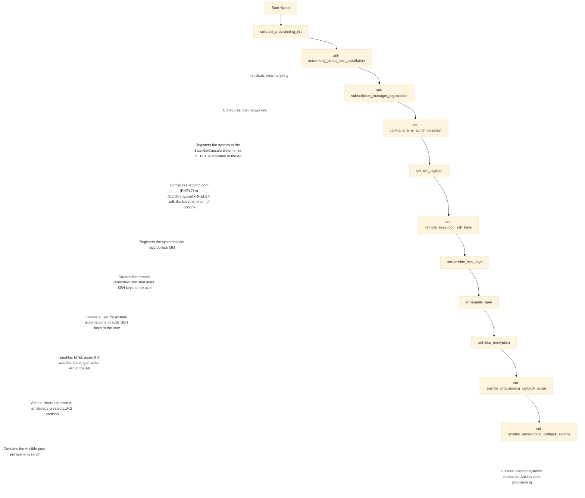

## Introduction

Following my [Red Hat Satellite 6 concept suggestion blog post](https://blog.scheib.me/2023/05/30/redhat-satellite-concept.html), I thought it made sense to share my highly
customized Kickstart to use with Red Hat Satellite 6.

In a later blog post, I'll further share how I make use of
[Template Sync](https://access.redhat.com/documentation/de-de/red_hat_satellite/6.12/html/managing_hosts/synchronizing_templates_repositories_managing-hosts) in Satellite. A
functionality, that allows importing the templates and also automatically assigning them to defined Operating Systems.

:warning: **Before you dig into this: Please read the following paragraph carefully.**

While it is absolutely possible to customize Kickstarts using Satellite, the degree of flexibility comes with a trade-off: **maintenance**. Please understand that in almost all
cases the provided Kickstarts by Red Hat fulfill perfectly the need of almost all use cases. When using highly customized Kickstarts you need to keep up with changes in the
Satellite and you need to keep up with the changes to Kickstart and RHEL. This means, every time a new update of the Satellite is released or a new major
version[^kickstart_changes] of RHEL is released, you need to carefully read the change log of the new Satellite version and check whether things you use
(e.g. [Satellite-Specific Macros](https://access.redhat.com/documentation/de-de/red_hat_satellite/6.12/html/managing_hosts/template_writing_reference_managing-hosts#Generic_Project-specific_Macros_managing-hosts))
have changed, have been deprecated or have been removed. The same for RHEL.

Further, you have to verify with each new Satellite release - and preferably RHEL release, that your Host Provisioning works exactly as you have designed it.

**This adds additional maintenance overhead that has to be done with *at least every* Satellite and RHEL major release!**

Please evaluate carefully whether the already provided Kickstarts fulfill your needs and if not, whether the things you'd like to change can be changed after provisioning a
system using automation (e.g. Ansible, Chef, Puppet, Salt, etc.).

Usually, the things you cannot change with ease *after* deploying hosts (such as partition tables), can easily be customized in Satellite without the need to completely
customize the Kickstarts. Partition tables, for instance, can easily be provided to Satellite using the Partition Tables object.

Back to topic .. :grin:

A few years back when I didn't fully understand the complete process of Kickstart in Satellite, I made an exercise and completely customized all the Kickstarts to my customer's
needs. That meant, removing everything that is not used actively and further to introduce a better logging mechanism and error handling. Since then, I have further optimized
and updated the Kickstart to be fully compatible with *my* use case.

Speaking of error handling: To be perfectly honest, I don't know if that has changed in the meanwhile, but back then (with Kickstart on RHEL 8 and using Satellite at least up
to Satellite 6.9), whenever a command failed in the `%post` section of the Kickstart, the Kickstart would continue to run. If you did not verify the provided host thoroughly
*after* deployment, you'd end up with an incompletely provisioned host.

Since RHEL 7, Kickstart supports
[error handling](https://access.redhat.com/documentation/de-de/red_hat_enterprise_linux/8/html/system_design_guide/kickstart-script-file-format-reference_system-design-guide#kickstart-error-handling-section_kickstart-script-file-format-reference)
to *some* degree. This error handling, however, concerns serious errors such as a failure in the Storage Selection. It does *not* cover, however, issues that happen due to
failing commands in the `%post` section.

Let me provide you with an example: Say we want to install a custom monitoring agent (e.g. [Zabbix](https://www.zabbix.com/)) during Kickstart using the following command:

```shell
dnf install zabbix-agent -y
```

The monitoring agent might be a necessity for your deployment and you want to make sure that it is installed. Well, if the package `zabbix-agent` isn't available, because you
might forgot to enable the repository within the Activation Key or you forgot to add the Content View that provides Zabbix, the Kickstart *will* continue to run like nothing
happened. It *will* show as a *successful build* within Satellite. Obviously, the build was not successful - at least not entirely, as a step failed. I'd consider this a
*failed* build.

You might argue that if you set up your services[^service] properly, this shouldn't happen. While you are correct, mistakes happen. For everybody.

Even if everything was set up correctly, what about a temporary network issue between your host and the responsible Capsule only at the moment when you try to install the
Zabbix agent? You will never notice it and you'd think the deployment was *successful*.

As you see, while customizing Kickstarts can provide you with some benefits, it comes with the trade-off of maintenance. If you are not comfortable in writing and
troubleshooting Kickstarts and troubleshooting the Host Provisioning in Satellite - or don't have the time to - you might consider stopping right here and now.

If you'd like to learn more about the way I Kickstart my systems to build from that your very own customized way of Kickstarting your systems, or if you are just curious:
Perfect, keep on reading. :grin:

## Overview

:information_source: If you are not familiar with Kickstart, please
[read up on that](https://access.redhat.com/documentation/de-de/red_hat_enterprise_linux/8/html/performing_an_advanced_rhel_8_installation/index) first. This is not an
*introduction* to Kickstart and I assume a good understanding of Kickstart throughout this blog post.

To get started with Kickstart in Satellite, we first need to take a look at how Satellite handles Kickstarts.

A Kickstart file in Satellite is rendered *before* transmitting it to the host that requested it. But what Satellite makes awesome for using with Kickstart is the high degree of
flexibility you get when using it. The reason being: **metadata**. If you followed my [earlier blog post](https://blog.scheib.me/2023/05/30/redhat-satellite-concept.html), you
know we defined *a lot* of different objects. Each of those objects provide a small piece of information about a system.

We can use these information pieces - or like I call them, metadata - to stitch together a highly customized Kickstart that *perfectly* fits for the system we are about to
deploy.

Before we dig deeper into Kickstart, we first need to understand how Satellite makes use of Templates and how we can leverage that functionality.

Satellite provides the following Template types:

| Template Type             | Description                                                                                                     |
| :------------------------ | :-------------------------------------------------------------------------------------------------------------- |
| Partition Tables          | This template type provides the possibility to, surprise, surprise, create partition templates for our hosts    |
| Job Templates             | We can use Job Templates to run Jobs within Satellite                                                           |
| Provisioning Templates    | These are the templates we can use for Kickstarting systems                                                     |
| Report Templates          | Report templates can be used to create, who have guessed that, reports                                          |

Our focus will be on *Partition Tables* and *Provisioning Templates*. Provisioning Templates are further separated into several
[Provisioning Template Types](https://access.redhat.com/documentation/de-de/red_hat_satellite/6.12/html/provisioning_hosts/configuring_provisioning_resources_provisioning#types-of-provisioning-templates_provisioning):

| Provisioning Template Types        |
| :--------------------------------- |
| `Provision`                        |
| `PXELinux`                         |
| `PXEGrub`                          |
| `PXEGrub2`                         |
| `Finish`                           |
| `user_data`                        |
| `cloud_init`                       |
| `Bootdisk`                         |
| `Kernel Execution (kexec)`         |
| `Script`                           |
| `ZTP`                              |
| `POAP`                             |
| `iPXE`                             |

As you see, there a lot of different Provisioning Templates available. In this blog post I'll focus on the following two:

- `PXELinux`
- `Provision`

We'll use the `PXELinux` template to render the parameters that are transmitted to a server that will boot into the
[`Preboot Execution Environment` (`PXE`)](https://de.wikipedia.org/wiki/Preboot_Execution_Environment). And the `Provision` template is where all the magic will happen. This will
define the Kickstart in its entirety.

There is one 'Template type' we haven't talked about. [Snippets](https://access.redhat.com/documentation/de-de/red_hat_satellite/6.12/html/managing_hosts/template_writing_reference_managing-hosts#Example_Template_Snippets_managing-hosts).
Snippets are small portions of code that can be reused multiple times throughout the Templates.

A Snippet might look something like this:

```erb
<%
os_major = @host.operatingsystem.major.to_i
os_minor = @host.operatingsystem.minor.to_i
%>

<% if ((os_minor < 5) && (os_major > 7)) -%>
<%# do something #%>
<% end -%>
```

As you might have guessed, the Templates (and Snippets) in Satellite are written in Ruby, Embedded Ruby (`ERB`), specifically. Usually. I say usually, because the `%post` section
of the Provisioning Template can be anything, really. That all depends on the options passed to the `%post` section. The `%post` section accepts an
`--interpreter=` [argument](https://access.redhat.com/documentation/de-de/red_hat_enterprise_linux/8/html/system_design_guide/kickstart-script-file-format-reference_system-design-guide#post-script-section-options_post-script-in-kickstart-file).
With that, we can make use of BASH (the default) or make use of Python, etc. as our `interpreter`. The great thing about this is that we can still make use of `ERB` in the
`%post` section. That is because Satellite *renders* the template *before* transmitting it to the client. So `ERB` code is evaluated before passing it to the client.

With that we can still use for instance `@host.operatingsystem.major.to_i` in any section of the Kickstart as it will be rendered by Satellite before the client actually uses it.

## Diving Deeper

Now that we have set a baseline, let's dive into my Kickstart templates. You can find them in my [GitHub repository](https://github.com/sscheib/satellite_templates).

:warning: The Kickstarts are built around *my* use case. Please *don't* use them as is. Evaluate them and check if they work for *your* use case.

Looking at the repository contents, we have the following files available:

```plaintext
pt-standard_bios.erb
pvt-ipxe.erb
pvt-provisioning.erb
pvt-pxelinux_default_local_boot.erb
pvt-pxelinux.erb
snt-ansible_provisioning_callback_script.erb
snt-ansible_provisioning_callback_service.erb
snt-ansible_ssh_keys.erb
snt-configure_time_synchronization.erb
snt-create_ip_config_string.erb
snt-enable_epel.erb
snt-idm_register.erb
snt-luks_encryption.erb
snt-networking_setup_post_installation.erb
snt-post_provisioning_init.erb
snt-remote_execution_ssh_keys.erb
snt-subscription_manager_registration.erb
```

As you can see, I have implemented a basic name concept:

begin nospell

| Prefix            | Meaning                        |
| :---------------- | :----------------------------- |
| `pt-`             | **P**artition **T**able        |
| `pvt-`            | **P**ro**v**ision **T**emplate |
| `snt-`            | **Sn**ippe**t**                |

end nospell

And I make heavy use of Snippets to make the Provision Template a little smaller and easier to read through.

### Partition Table

Let's look first at the Partition Table:

```erb
<%#
kind: ptable
name: pt-standard_bios
model: Ptable
oses:
- RedHat 7
- RHEL 7
- RedHat 8
- RHEL 8
- RedHat 9
- RHEL 9

locations:
- loc-core

organizations:
- org-core
-%>

<%#
author: Steffen Scheib (steffen@scheib.me)

custom snippets:
  none

snippets:
  none

changelog:
22.05.2023 - Steffen Scheib:
- Renamed encrypt_system host parameter to p-encrypt_system

04.09.2021 - Steffen Scheib:
- Initial version
%>
#Dynamic

# Define some variables
<%
   os_major = @host.operatingsystem.major.to_i
   fs_type = 'xfs'
   vg_name = 'system'
-%>

if [ -e /dev/sda ]; then
  dev_device="sda"
elif [ -e /dev/vda ]; then
  dev_device="vda"
fi

cat <<EOF > /tmp/diskpart.cfg
  zerombr
  # Partition clearing information
  bootloader --location=mbr --append="splash=quiet"
  clearpart --all --initlabel --drives="${dev_device}" --disklabel=gpt
  # as we have gpt, we need a separate biosboot partition
  part biosboot --fstype=biosboot --size=1
EOF

cat <<EOF >> /tmp/diskpart.cfg
  # Disk partitioning information with <%= fs_type %>
  part /boot --fstype=<%= fs_type %> --size=4096

  # encrypt only systems with the host parameter p-encrypt_system set
  <% if host_param('p-encrypt_system') %>
    # create an encrypted physical volume
    part pv.0 --grow --ondisk="${dev_device}" --encrypted --passphrase=<%= host_param('crypted_system_initial_passphrase') %>
  <% else %>
    part pv.0 --grow --ondisk="${dev_device}"
  <% end -%>

  volgroup vg_<%= vg_name %> pv.0

  logvol /              --fstype <%= fs_type %> --name=lv_root          --vgname=vg_<%= vg_name %> --size=10240
  logvol /var/log/audit --fstype <%= fs_type %> --name=lv_var_log_audit --vgname=vg_<%= vg_name %> --size=2048   --fsoptions="nodev,nosuid,noexec"
  logvol /var/log       --fstype <%= fs_type %> --name=lv_var_log       --vgname=vg_<%= vg_name %> --size=5120   --fsoptions="nodev,nosuid,noexec"
  logvol /var/tmp       --fstype <%= fs_type %> --name=lv_var_tmp       --vgname=vg_<%= vg_name %> --size=2048   --fsoptions="nodev,nosuid"
  logvol /usr           --fstype <%= fs_type %> --name=lv_usr           --vgname=vg_<%= vg_name %> --size=8192   --fsoptions="nodev"
  logvol /usr/local     --fstype <%= fs_type %> --name=lv_usr_local     --vgname=vg_<%= vg_name %> --size=1024   --fsoptions="nodev"
  logvol /openscap      --fstype <%= fs_type %> --name=lv_openscap      --vgname=vg_<%= vg_name %> --size=512    --fsoptions="nodev,noexec"
  logvol /home          --fstype <%= fs_type %> --name=lv_home          --vgname=vg_<%= vg_name %> --size=1024   --fsoptions="nodev,nosuid"
  logvol /tmp           --fstype <%= fs_type %> --name=lv_tmp           --vgname=vg_<%= vg_name %> --size=5120   --fsoptions="nodev,nosuid,noexec"
  logvol /var           --fstype <%= fs_type %> --name=lv_var           --vgname=vg_<%= vg_name %> --size=8192   --fsoptions="nodev,nosuid"
  logvol /opt           --fstype <%= fs_type %> --name=lv_opt           --vgname=vg_<%= vg_name %> --size=4096   --fsoptions="nodev"
  logvol swap           --fstype swap           --name=lv_swap          --vgname=vg_<%= vg_name %> --size=4096
EOF
```

The Partition Table itself is pretty straight forward, but I'd like to point out two things.

First, I start *every* template with a comment block of `ERB` (`<%# #%>`) which contains metadata for Satellite's `TemplateSync` (more on that in a later blog post).

Secondly, the next comment block is *not* used by Satellite, but rather by myself to quickly look up what I changed when. I know, this is rather an old-school technique, but
for me it works to keep track of what I have changed when and why. Yes, the same is present as well in `git log`, but I find it quite handy to have such things in each template
as well.

### Provision Template

My Provision Templates and Snippets contain further a section with `Supported host parameters`[^host_params]. These list the parameters of each Template and Snippet that can be
overridden/set to customize the behavior of them. The exception is `pvt-provisioning`. Within this template *all* available parameters for the Provision Template are included -
including those that are actually included through Snippets during provisioning. This way you have *one* place to look up which parameters are supported. Of course this is a
manual effort, and thus the documentation inside those templates is only helpful when you keep it up-to-date. I also include a section with `Snippets` and `Custom snippets`.
These are self explanatory.

Below you'll find an excerpt of the Provision Template's header which lists the supported parameters:

```erb
<%#
author: Steffen Scheib (steffen@scheib.me)

description:
This kickstart provisioning template is the "base" template and contains all required key arguments for the kickstart installation.

custom snippets:
- snt-post_provisioning_init
- snt-subscription_manager_registration
- snt-configure_time_synchronization
- snt-remote_execution_ssh_keys
- snt-enable_epel
- snt-networking_setup_post_installation
- snt-luks_encryption

snippets:
  none

supported host parameters:
> host parameter name                    | type      | snippet/template name                        | description                                     <
-----------------------------------------+-----------+----------------------------------------------+-------------------------------------------------+
> lang                                   | string    | pvt-provision                                | Language to set for the operating system
*                                        |           |                                              | Default: 'en_US.UTF-8'
+----------------------------------------+-----------+----------------------------------------------+-------------------------------------------------+
> keyboard                               | string    | pvt-provision                                | Keyboard layout to use for the operating system
*                                        |           |                                              | Default: 'de'
+----------------------------------------+-----------+----------------------------------------------+-------------------------------------------------+
> selinux                                | string    | pvt-provision                                | Mode of SELinux to set for the operating system
*                                        |           |                                              | Default: 'enforcing'
+----------------------------------------+-----------+----------------------------------------------+-------------------------------------------------+
> time-zone                              | string    | pvt-provision                                | Timezone the operating system should be set to
*                                        |           |                                              | Default: 'UTC'
+----------------------------------------+-----------+----------------------------------------------+-------------------------------------------------+
> p-encrypt_system                       | boolean   | pvt-provision                                | Whether to encrypt the system with luks
*                                        |           |                                              | Default: Unset
+----------------------------------------+-----------+----------------------------------------------+-------------------------------------------------+
> p-ks_debug                             | boolean   | snt-post_provisioning_init                   | If true, the %post section will enable set -x for
*                                        |           |                                              | BASH
*                                        |           |                                              | Default: false
+----------------------------------------+-----------+----------------------------------------------+-------------------------------------------------+
> syspurpose_role                        | string    | snt-subscription_manager_registration        | If set, sets the syspurpose role within
*                                        |           |                                              | subscription-manager
*                                        |           |                                              | Default: Unset
+----------------------------------------+-----------+----------------------------------------------+-------------------------------------------------+
> syspurpose_usage                       | string    | snt-subscription_manager_registration        | If set, sets the syspurpose usage within
*                                        |           |                                              | subscription-manager
*                                        |           |                                              | Default: Unset
+----------------------------------------+-----------+----------------------------------------------+-------------------------------------------------+
> syspurpose_sla                         | string    | snt-subscription_manager_registration        | If set, sets the syspurpose SLA within
*                                        |           |                                              | subscription-manager
*                                        |           |                                              | Default: Unset
+----------------------------------------+-----------+----------------------------------------------+-------------------------------------------------+
> syspurpose_addons                      | string    | snt-subscription_manager_registration        | If set, sets the syspurpose addons within
*                                        |           |                                              | subscription-manager
*                                        |           |                                              | Default: Unset
+----------------------------------------+-----------+----------------------------------------------+-------------------------------------------------+
> additional_repositories                | string    | snt-subscription_manager_registration        | Additional repositories to enable to the already
*                                        |           |                                              | enabled within the activation key. Repositories
*                                        |           |                                              | have to be passed as comma-seperated string
*                                        |           |                                              | Example: 'repo1,repo2'
*                                        |           |                                              | Default: Unset
+----------------------------------------+-----------+----------------------------------------------+-------------------------------------------------+
> idm_ssh                                | boolean   | snt-idm_register                             | If false, disables sssd ssh integration with
*                                        |           |                                              | command line parameter --no-ssh
*                                        |           |                                              | Default: true
+----------------------------------------+-----------+----------------------------------------------+-------------------------------------------------+
> idm_mkhomedir                          | boolean   | snt-idm_register                             | If false, disables the configuration of ssd for
*                                        |           |                                              | automatical creation of home
*                                        |           |                                              | directories (--mkhomedir will not be passed as
*                                        |           |                                              | argument)
*                                        |           |                                              | Default: true
+----------------------------------------+-----------+----------------------------------------------+-------------------------------------------------+
> idm_opts                               | string    | snt-idm_register                             | If set, these additional command line parameters
*                                        |           |                                              | will be passed to the ipa-client-install command
*                                        |           |                                              | Default: Unset
+----------------------------------------+-----------+----------------------------------------------+-------------------------------------------------+
> remote_execution_ssh_user              | string    | snt-remote_execution_ssh_keys                | User for which remote_execution_ssh_keys will be
*                                        |           |                                              | authorized
*                                        |           |                                              | Default: 'satellite-remote'
+----------------------------------------+-----------+----------------------------------------------+-------------------------------------------------+
> remote_execution_ssh_user_comment      | string    | snt-remote_execution_ssh_keys                | Comment to set for the user
*                                        |           |                                              | Default: 'RedHat Satellite Remote User'
+----------------------------------------+-----------+----------------------------------------------+-------------------------------------------------+
> p-remote_execution_ssh_keys            | string    | snt-remote_execution_ssh_keys                | Public keys to be put in
*                                        |           |                                              | <ssh_user>/.ssh/authorized_keys
*                                        |           |                                              | One key per line should be added
*                                        |           |                                              | Default: Unset
+----------------------------------------+-----------+----------------------------------------------+-------------------------------------------------+
> dns_alt_names                          | string    | snt-puppet                                   | If set, sets the alternative dns name in the
*                                        |           |                                              | Puppet configuration file
*                                        |           |                                              | Default: Unset
+----------------------------------------+-----------+----------------------------------------------+-------------------------------------------------+
> p-ks_debug_network                     | boolean   | snt-networking_setup_post_installation       | If true, writes networking information for
*                                        |           |                                              | debugging purposed to
*                                        |           |                                              | /root/network_during_installation.log
*                                        |           |                                              | Default: Unset
+----------------------------------------+-----------+----------------------------------------------+-------------------------------------------------+
> p-crypted_system_initial_passphrase    | string    | snt-luks_encryption                          | This passphrase was used to initially create the
*                                        |           |                                              | luks partition and within this snippet will be
*                                        |           |                                              | removed again
*                                        |           |                                              | Default: Some Secret Password :)
+----------------------------------------+-----------+----------------------------------------------+-------------------------------------------------+
> p-ansible_provisioning                 | boolean   | pvt-provisioning                             | Determines whether post provisioning with Ansible
*                                        |           |                                              | should be done
*                                        |           |                                              | Default: true
+----------------------------------------+-----------+----------------------------------------------+-------------------------------------------------+
> p-ansible_host_config_key              | string    | snt-ansible_provisioning_callback_service    | Host config key to pass to the Ansible
*                                        |           |                                              | Automation Controller call
*                                        |           |                                              | Default: None
+----------------------------------------+-----------+----------------------------------------------+-------------------------------------------------+
> p-ansible_job_template_id              | integer   | snt-ansible_provisioning_callback_service    | ID of the job template to trigger of the
*                                        |           |                                              | Ansible Automation Controller
*                                        |           |                                              | Default: None
+----------------------------------------+-----------+----------------------------------------------+-------------------------------------------------+
> p-ansible_ssh_user                     | string    | snt-ansible_ssh_keys                         | User for which p-ansible_ssh_keys will be authorized
*                                        |           |                                              | Default: 'remote-ansible'
+----------------------------------------+-----------+----------------------------------------------+-------------------------------------------------+
> p-ansible_ssh_user_comment             | string    | snt-ansible_ssh_keys                         | Comment to set for the user
*                                        |           |                                              | Default: 'Red Hat Ansible Automation Platform Remote User'
+----------------------------------------+-----------+----------------------------------------------+-------------------------------------------------+
> p-ansible_ssh_keys                     | string    | snt-ansible_ssh_keys                         | Public keys to be put in <ssh_user>/.ssh/authorized_keys
*                                        |           |                                              | One key per line should be added
*                                        |           |                                              | Default: Unset
+----------------------------------------+-----------+----------------------------------------------+-------------------------------------------------+
> p-ansible_controller_host              | string    | snt-ansible_provisioning_callback_service    | Ansible Automation Controller Host
*                                        |           |                                              | Default: Unset
+----------------------------------------+-----------+----------------------------------------------+-------------------------------------------------+
> p-enable_fips_deployment               | boolean   | pvt-provisioning                             | Whether to enable FIPS mode
*                                        |           |                                              | Default: Unset
+----------------------------------------+-----------+----------------------------------------------+------------------------------------------------->
```

:information_source: Variables that have prefixed a `p-` are custom parameters of my Snippets or the Provisioning Template. Parameters without `p-` are parameters that are present
in Red Hat's default Kickstart.

The Provision Template also includes the exit codes of the `%post` section (should it fail) and the log files that are used during provisioning, which will be helpful when
troubleshooting a failed installation:

```plaintext
exit codes:
0: Installation successfully finished
1: Unable to determine package manager to use
2: Unused
3: Host parameter 'p-encrypt_system' given (true), but unable to determine a single currently installed kernel and thus cannot decide which kernel version to use
4: Host parameter 'p-encrypt_system' given (true), but no Tang servers could be discovered using _tang._tcp.@host.domain
5: Host parameter 'p-encrypt_system' given (true), but not all Tang servers discovered via _tang._tcp.@host.domain were reachable
6: Host parameter 'p-encrypt_system' given (true), but it was discovered, that GRUB_CMDLINE_LINUX in file /etc/default/grub is empty
7: /var/log is not mounted
8: Realm is not set
9: Command 'dig' is not available
10: Unable to create directory /mnt/sysimage/var/log/journal
11: Unable to run command 'sync'

Note: These are only the *defined* exit codes! If a command exits with an error (exit code not equals zero) within the main %post section,
      this exit code will be used to exit the post installation.

log files:
> log file path                                         | description <
+-------------------------------------------------------+--------------------------------------------------------------------------------------------+
> /root/install.post.no.chroot.log                      | Contains the log of the first post section without chroot, which basically copies only the
>                                                       | file /etc/resolv.conf from the host system to the chroot
+-------------------------------------------------------+--------------------------------------------------------------------------------------------+
> /root/install.post.script.log                         | Contains the output of the "main" post section from the function write_output
+-------------------------------------------------------+--------------------------------------------------------------------------------------------+
> /root/install.post.log                                | Contains stdout and stderr of the "main" post section
+-------------------------------------------------------+--------------------------------------------------------------------------------------------+
> /root/install.post.no.chroot.journal.log              | Contains the output from the post section, which makes journald logs persistent
+-------------------------------------------------------+--------------------------------------------------------------------------------------------+
> /root/install.post.notification.log                   | Contains the output of the post section, which notifies foreman about the finished build
+-------------------------------------------------------+-------------------------------------------------------------------------------------------->
-%>
```

### `%post` section flow

Since the `%post` section is the most complex one, let me walk you through it step by step.

Okay, actually there are multiple `%post` sections. Let's focus on the one that does the heavy lifting (I'll briefly explain the others later on):

`%post --interpreter=/bin/bash --log=/root/install.post.log`

For an initial overview, let's start with a flow chart:



That's quite a list, let's go through them step by step.

#### Template: `pvt-provision`

Before we dive into the Snippets, a couple of things happen in the Provision Template that are noteworthy.

First, we switch to [TTY](https://man7.org/linux/man-pages/man4/tty.4.html) 3 so that we can actually see something during provisioning :grin:.

Moreover the following things happen (in between these steps various Snippets are run):

- Import the GPG keys for RHEL to avoid an exit code of `dnf` and `yum` which signals an error (greater than 0)
- Install some applications that I'd like to have on all of my systems (such as `systat`, `tmux` and `vim-enhanced`). I install them separately as they are in the RHEL AppStream
  repository and some time ago (I cannot recall in which RHEL minor and Satellite version exactly) it was not possible to enable more than one repository *before* Kickstart enters
  the `%post` section
- Update all packages: That is important as we might have booted from an older RHEL minor release while the Content View might provide a later version of RHEL
- Define `__NTP_SERVER` (more on that in [`snt-configure_time_synchronization`](#snippet-snt-configure_time_synchronization))
- Create the file `./autorelabel` to force relabeling of SELinux contexts

.. and as mentioned it includes all the Snippets that we have seen in the flow chart in the [`%post` section flow](#post-section-flow)

#### Snippet: `snt-post_provisioning_init`

This very first snippet is probably the most important one. It sets up a [BASH exit trap](https://tldp.org/LDP/Bash-Beginners-Guide/html/sect_12_02.html) and ensures that whenever
**any** command fails, the provisioning fails as well (`set -o errexit`). Exiting should also happen if a pipe is used (`|`) and any command in the complete pipe fails
(`set -o pipefail`). To avoid that variables are referenced without being defined (something BASH does not care about by default), it ensures that unset variables are treated as
an error (`set -o nounset`). Lastly, all of that should also apply to [sub-shells](https://tldp.org/LDP/abs/html/subshells.html) (`set -o errtrace` and `set -o functrace`).

Okay, but why all of that?

This procedure guarantees that **every** provisioning was **successful**. Not partially successful, but **completely successful**.

Of course, it requires that commands that are invoked 'play nicely' and exit with a proper exit code when they encounter an error.

It also has (as with everything) a downside: You need to ensure that every command you invoke, every sub-shell you spawn and every process you invoke needs to **succeed**.
Otherwise the installation **will** terminate.

A good example of *bad behavior* is for instance `subscription-manager`. When you enable [Simple Content Access (SCA)](https://access.redhat.com/articles/simple-content-access)
for your Satellite, you don't need a subscription and thus Satellite clients have no subscription assigned. `subscription-manager` considers this to be an error and when it exits,
it exits with an exit code that indicates an error.

So, how do you deal with a situation like this? Just let BASH know it's okay if the process fails. See the following example:

```erb
subscription-manager register --name='<%= @host.name %>' --org='<%= subscription_manager_org %>' --activationkey='<%= activation_key %>' || true
```

The `||` is a [logical OR operator](https://tldp.org/LDP/abs/html/comparison-ops.html) that *guarantees* that the command does not fail. Everything that we put before the `||`
will evaluate as `true`; Thus it is considered as *succeeded*.

Let me try to explain that a bit more 'understandable' :speak_no_evil:

Consider the following example code:

```shell
command1 || true
```

Using natural language this would translate to something like: "Run `command1` but if that fails, don't worry, it's fine anyway."

You can even do `false || true` and you'll see with `echo $?` (which returns the last exit code) that BASH exited with 0 (which equals to `true` in BASH - unlike in *every* other
language :see_no_evil: ).

Does that obsolete the use of the BASH options that have been implemented in the beginning?

Yes, absolutely. But only for this **one** command. I think it's better to be 99% sure that a system has been deployed successfully, compared to close to 0% (when not using the
aforementioned BASH options).

This 'workaround' can be used for every command you encounter that doesn't 'play nice'. **But**, remember, the more often you do it (maybe just to 'make it work') the less
useful the BASH options are and with every use of `||` you can be less and less sure whether the system has really been deployed successfully.

Obviously, this is a very strict way of deploying systems. And one could argue even cumbersome. You can do a post provisioning check with your preferred automation tool *after*
provisioning.

While that it is correct, I found my way more intuitive and more *'fail-proof'*, compared to a post provisioning check, as I can rule out e.g. `DNS` issues due to a failed `IdM`
enrollment (which would render my post provisioning check useless, as I am unable to reach it via `DNS`).

#### Snippet: `snt-networking_setup_post_installation`

Next up we have the Snippet `snt-networking_setup_post_installation`. It is derived from the Snippets that Red Hat ships by default:

- `kickstart_networking_setup`
- `kickstart_ifcfg_get_identifier_names`
- `kickstart_ifcfg_bond_interface`
- `kickstart_ifcfg_bonded_interface`
- `kickstart_ifcfg_generic_interface`

I decided to put everything into *one* Snippet instead of splitting it out like Red Hat did. The original ones *make sense*, don't get me wrong, but since I have it highly
customized on *my* use case, I don't need to split the Snippets as I don't reuse them anywhere else. The splitting *probably* happened with the initial thought
of: "*I might be able to reuse it!*". For me this is not necessary and introduces more complexity when troubleshooting (you need to switch between different Snippets all the
time), so I merged all of them.

Additionally, my customized version supports `VLANs`. Something that the original Snippets do not.

Further, I modified it in such a way, that the Snippet is actually readable (with a few comments added as well), as I find the original one is hard to read and thus hard to
troubleshoot should you encounter issues.

Here is the thing: You can make Templates in Satellite with `ERB` readable in two ways. Either you indent the `ERB` code itself like so:

```erb
    # Loop 1.1: iterate over all managed slave interfaces of this bond
  <% @host.interfaces_with_identifier(bond.attached_devices_identifiers).each do |interface| -%>
    <% next if !interface.managed? -%>

    <%
    subnet = interface.subnet
    virtual = interface.virtual?
    vlan = virtual && (subnet.has_vlanid? || interface.vlanid.present?)
    alias_type = virtual && !subnet.nil? && !subnet.has_vlanid? && interface.identifier.include?(':')
    dhcp = !subnet.nil? && subnet.dhcp_boot_mode?
    -%>
```

Or, you indent the code inside the `ERB` tags, like so:

```erb
<%- @host.bond_interfaces.each do |bond| -%>
<%-   bonding_interfaces.push(bond.identifier) -%>
<%=   "# #{bond.identifier} interface" %>
```

The difference is, that Ruby, well `ERB`, does *not care* about indentation inside the `ERB` tags (`<%- -%>`, `<%=  %>`, etc.). This will result in a rendered file which has the
beginning of each line at the very start without any spaces in front.

If you chose my method (which I find more readable), you'll end up with a *rendered* file (after `ERB` was processed) that looks like this:

```shell
    BOOTPROTO=dhcp
      IPADDR=172.31.3.254
      NETMASK=255.255.255.0
        GATEWAY=172.31.3.1

    DEVICE=eno1
    ONBOOT=yes
    PEERDNS=no
    PEERROUTES=no
    DEFROUTE=yes
    TYPE=Bond
```

This sometimes is a problem for the application that makes use of the rendered file ultimately (in this case `NetworkManager`), but more important, makes it hard to troubleshoot
after deployment.

To overcome situations like this, I simply use the following approach (within Kickstart):

```shell
  sed -i -E 's/^[[:space:]]+//g' "${file}"
  sed -i '/^$/d' "${file}"
```

The above `sed` commands will remove white spaces at the beginning (that happened due to indentation) and remove empty lines. Of course, this is an extra step that needs to be
performed, during Kickstart. For me, though, the benefits outweigh the downsides of this. I can read and troubleshoot the Kickstart files in Satellite a lot better, as the
indentation is simply correct.

#### Snippet: `snt-subscription_manager_registration`

Next up is the Snippet `snt-subscription_manager_registration`. It is derived of `redhat_register` and has been overly simplified. It does *not* support an HTTP proxy, for
instance, as I don't need it.

The one specialty I'd like to point out is that it checks for [Extra Packages for Enterprise Linux (`EPEL`)](https://docs.fedoraproject.org/en-US/epel) repositories and disables
them right after registering with Satellite.

The responsible code Snippet is the following:

```erb
write_output "Trying to find out if EPEL is activated within the activation key <%= host_param('kt_activation_keys') %>" "INFO";
__ORGANIZATION_NAME="<%= @host.rhsm_organization_label %>"
__PRODUCT_NAME="prd-fedora-epel"
__REPOSITORY_NAME="repo-epel-latest-el-<%= @host.operatingsystem.major.to_i %>"
__REPOSITORY_ID="${__ORGANIZATION_NAME}_${__PRODUCT_NAME}_${__REPOSITORY_NAME}"

write_output "Repository ID: ${__REPOSITORY_ID}" "INFO";

# Also it is worth to update subscription-manager at this moment
write_output "Updating subscription-manager" "INFO";
${__PACKAGE_MANAGER} ${__PACKAGE_MANAGER_ARGUMENTS} update subscription-manager

foundEpelRepositoryName=1
foundEpelRepositoryId=1

# go line-wise through enabled repositories
while read -r subscriptionInformationLine; do
    # we only care for repo ID and name
    if [[ ! "${subscriptionInformationLine^^}" =~ ^REPO[[:space:]]ID|NAME: ]]; then
        continue;
    fi

    # both repo ID and name need to be found
    if [[ "${subscriptionInformationLine^^}" =~ ^REPO[[:space:]]ID:[[:space:]]+${__REPOSITORY_ID^^}$ ]]; then
        foundEpelRepositoryId=0
    elif [[ "${subscriptionInformationLine^^}" =~ ^REPO[[:space:]]NAME:[[:space:]]+${__REPOSITORY_NAME^^}$ ]]; then
        foundEpelRepositoryName=0
    fi
done < <(subscription-manager repos --list-enabled)

if [[ "${foundEpelRepositoryId}" -eq 0 ]] && [[ "${foundEpelRepositoryName}" -eq 0 ]]; then
    write_output "Found enabled EPEL repository, will disable it for now" "INFO";
    subscription-manager repos --disable "${__REPOSITORY_ID}"
fi
```

You might have noticed that the `__PRODUCT_NAME` and `__REPOSITORY_NAME` is based on my naming concept for Satellite[^naming_concept]. The definition of the `__REPOSITORY_ID` on
the other hand is Satellite's default for custom repositories and is not influenced by me in any way.

Now to the reason why this is important: There are situations where you'd like to have `EPEL` repositories enabled, but there is catch with that. `EPEL` often times contains more
updated version of packages. This becomes an issue, when you mix and match the dependencies with packages from RHEL, as they are usually not meant to work with dependencies that
have a newer version than what is shipped in RHEL (e.g. `EPEL`). To prevent issues right from the get-go, I disable `EPEL` before installing or updating any packages. After the
provisioning has been done, the `EPEL` repository will be enabled again (that is done by the Snippet [`snt-enable_epel`](#snippet-snt-enable_epel)) if the `EPEL` repository is enabled
within the Activation Key.

#### Snippet: `snt-configure_time_synchronization`

The snippet `snt-configure_time_synchronization` has one job: Configuring the time synchronization either via `NTPd` (RHEL 7) or (RHEL 8 and above) `chronyd`. It deploys a
**minimalist** configuration for either of the daemons to ensure that the time is correct before we register the system to Red Hat's Identity Management (`IdM`). If the time deviates
too much of the actual time, enrolling to `IdM` would fail (Microsoft Active Directory (AD) would refuse to add the system as well). This is because `LDAP` is (usually!) based on SSL
and SSL needs to have correct date and time set otherwise it will not work properly.

The `NTP` server to use, however, is determined way earlier in the Kickstart process. It is gathered in [`pvt-provisioning`](#template-pvt-provision) with the following code:

```erb
declare -r __NTP_SERVER="$(dig +short _ntp._udp.<%= @host.domain -%> SRV | awk '{print $4}' | sed 's/\.$//')"
```

The above code snippet queries the `DNS` and asks for a [service (`SRV`) record](https://en.wikipedia.org/wiki/SRV_record) at `_ntp._udp.example.com`. This means that you need to have
an `SRV` record for `_ntp._udp.example.com` as otherwise the provisioning will fail (early in the Kickstart). Of course, you need to substitute `example.com` with the domain the
host is going to be provisioned.

To as why the `NTP` server is determined early in the Kickstart and not in this Snippet: In the beginning of the Kickstart (*almost* at start of the `%post` section), I determine
everything that is required for the installation to proceed. Among these things is the `NTP` server. This is a benefit, because the installation will fail quicker and that way you
save some time. :sunglasses:

#### Snippet: `snt-idm_register`

The Snippet `snt-idm_register` is derived by Red Hat's Snippet `freeipa_register`. It is basically the same, but with removed support for any RHEL version prior to RHEL 7.

It is important to note, that *before* we install the `ipa-client` we updated the system to the latest available version. It is important, because otherwise, we would install
the latest available `ipa-client` on an older RHEL version, which *can* cause issues.

Moreover, the
[`IdM` documentation](https://access.redhat.com/documentation/de-de/red_hat_enterprise_linux/8/html/installing_identity_management/preparing-the-system-for-ipa-client-installation_installing-identity-management#installing-idm-client-packages-from-the-idm-client-stream_preparing-the-system-for-ipa-client-installation)
notes that installing the `ipa-client` on RHEL 8 should be done by enabling the respective `module` instead of installing the `ipa-client`:

```shell
dnf -y module install idm
```

Something, that is not part of the original Template. Maybe there is already a bug open for that which describes this issue or there might be a legitimate reason that it
is done differently - I don't know. I chose to use the way the `IdM` documentation outlines.

#### Snippets: `snt-remote_execution_ssh_keys` and `snt-ansible_ssh_keys`

Both `snt-remote_execution_ssh_keys` and `snt-ansible_ssh_keys` are practically the same. Both create a **local** user and add the defined SSH keys to the user. That's it,
nothing special :slightly_smiling_face:

#### Snippet: `snt-enable_epel`

This snippet is pretty simple as well. It enabled `EPEL` again, when it is enabled within the Activation Key.

#### Snippet: `snt-luks_encryption`

This Snippet is entirely custom-made and based on the documentation of
[`clevis luks bind`](https://access.redhat.com/documentation/de-de/red_hat_enterprise_linux/8/html/security_hardening/configuring-automated-unlocking-of-encrypted-volumes-using-policy-based-decryption_security-hardening#configuring-manual-enrollment-of-volumes-using-clevis_configuring-automated-unlocking-of-encrypted-volumes-using-policy-based-decryption).
This Snippet provides the possibility to use [Network Bound Disk Encryption (`NBDE`)](https://access.redhat.com/documentation/de-de/red_hat_enterprise_linux/8/html/security_hardening/configuring-automated-unlocking-of-encrypted-volumes-using-policy-based-decryption_security-hardening#network-bound-disk-encryption_configuring-automated-unlocking-of-encrypted-volumes-using-policy-based-decryption)
and requires **two** installed and configured [Tang servers](https://access.redhat.com/documentation/de-de/red_hat_enterprise_linux/8/html/security_hardening/configuring-automated-unlocking-of-encrypted-volumes-using-policy-based-decryption_security-hardening#deploying-a-tang-server-with-selinux-in-enforcing-mode_configuring-automated-unlocking-of-encrypted-volumes-using-policy-based-decryption)
(to have a backup Tang server should one die).

#### Snippets: `snt-ansible_provisioning_callback_script` and `snt-ansible_provisioning_callback_service`

These last two Snippets place a script on the server and create a `systemd service` that launches a specific Job Template in Ansible Automation Platform. That Job Template would
usually configure the system initially; That would typically be such tasks as applying hardening, etc. This `systemd service` only runs *once* and disables itself afterwards.

### The different `%post` sections

With the Provisioning Template `pvt-provisioning` I included multiple `%post` sections. We have discussed the one that does the heavy lifting above. But there are three more :grin:

They are defined as follows:

1. `%post --interpreter=/bin/bash --nochroot --log=/mnt/sysimage/root/install.post.no.chroot.log`
1. `%post --interpreter=/bin/bash --log=/root/install.post.log` - this is the one that we have been discussing
1. `%post --nochroot --log=/mnt/sysimage/root/install.post.no.chroot.journal.log`
1. `%post --interpreter=/bin/bash --log=/root/install.post.notification.log`

The `%post` sections are evaluated from top to bottom. Even if one of them exited with an error the remaining `%post` sections will be evaluated.

Let's quickly talk about the different `%post` sections.

1. The first `%post` section merely copies `/etc/resolv.conf` to the environment we are going to [`chroot`](https://linux.die.net/man/1/chroot) into
(`/mnt/sysimage/etc/resolv.conf`) so that we are able to do `DNS` resolution.
1. We have discussed the second `%post` section thoroughly.
1. The third `%post` section specifies the option `--nochroot`. This option is necessary, as we need control over `systemd` (which is not possible when being in a `chroot`). In
this `%post` section we ensure that we don't lose any `journald` logs by making them persistent.
1. This `%post` section is responsible for notifying the Satellite whether the installation went successful. It is determined that the installation failed when the file
`/tmp/installation.successful` does not exist. The file `/tmp/installation.successful` is created as the very last step in the main `%post` section. As it is the last command
that is executed in the main `%post` section, we can guarantee that the installation succeeded (due to the aforementioned BASH options).

### `PXELinux` Templates

Lastly, we need to talk about the two `PXELinux` Templates I have in my repository:

- `pvt-pxelinux`
- `pvt-pxelinux_default_local_boot`

#### Template: `pvt-pxelinux`

This Template will render the options which are passed to our clients when they boot via `PXE` and the host has a build scheduled (build mode is set to `true` for the Host in Satellite).
It doesn't look like much, but if you look closely, I include a Snippet: `snt-create_ip_config_string`
This Snippet is where the heavy lifting is done. It will generate all the networking parameters that are required. It is derived from the `kickstart_kernel_options` Template, but
again, heavily stripped down on what I need. On top, it fully supports `VLANs` and bonding. At the time I created my Snippet, that didn't work with the original one. In the
meanwhile, the original one also provides this functionality :slightly_smiling_face:

#### Template: `pvt-pxelinux_default_local_boot`

The Template `pvt-pxelinux_default_local_boot` is derived from `PXELinux default local boot` and contains only one change: I set the timeout to 3 seconds instead of the
default 20 seconds. I just got tired of waiting.

## Closing thoughts

There is one Template we haven't talked about: `pvt-ipxe`. It is included because some time ago I used it. I no longer do, but I didn't want to throw it away, in case I would
need it at some point. It was used to build Host/Full Host images and use those images to install my systems. I switched over to `PXE` - it is just much more convenient
:slightly_smiling_face:

We have been discussing *my* way of Kickstarting in this blog post. There are virtually unlimited ways of doing the same thing but different to this approach.

Decide on your own, if such a highly customized Kickstart is worth the maintenance .. until next time :sunglasses:

## Change log

### 2024-03-11

- `markdownlint` fixes
- Spelling fixes

### 2024-03-09

- `markdownlint` fixes

## Footnotes

[^kickstart_changes]:**Typically**, *major changes* to Kickstart are *not* introduced in a minor version of RHEL. This, however, is *not* guaranteed.
[^service]:[Read more about *my* definition of a *service* in Satellite](https://blog.scheib.me/2023/05/30/redhat-satellite-concept.html#definition-of-a-service)
[^host_params]:The section name `Supported host parameters` is actually a bit misleading. You can, of course, override the parameters on any level in Satellite (Global, Host Group, Host, etc.).
[^naming_concept]:[Red Hat Satellite Naming Concept](https://blog.scheib.me/2023/05/30/redhat-satellite-concept.html#naming-concept)
